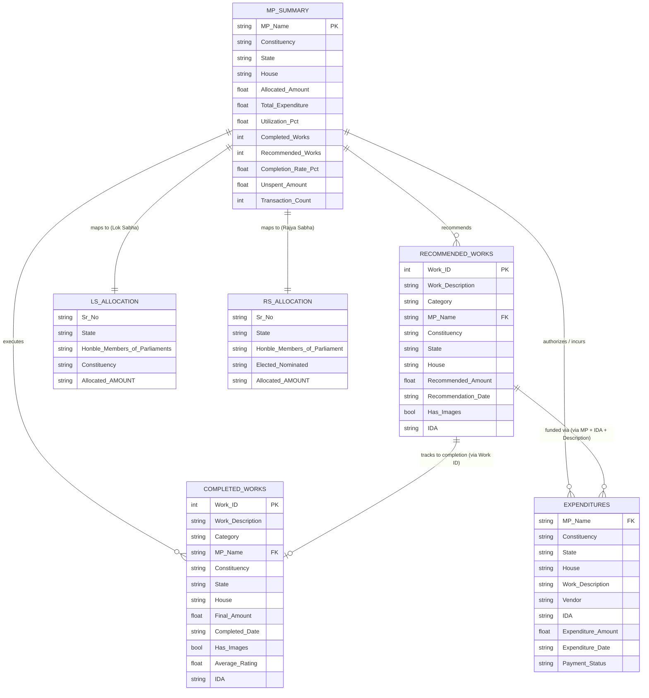

# MPLADS Risk Analytics — Dataset Documentation & Data Dictionary

> **Comprehensive Dataset Catalog & Analytical Reference**  
> **Source Context:** Member of Parliament Local Area Development Scheme (MPLADS) Data (Snapshotted as of **August 22, 2026**)  
> **Repository:** `gouravverma23/mplads-risk-analytics`  
> **Directory:** `Datasets/`

---

## 1. Executive Summary & Aggregate Overview

This dataset collection provides a complete granular snapshot of the **MPLADS (Member of Parliament Local Area Development Scheme)** implementation across India. It tracks fund allocations, work recommendations, execution progress, vendor payments, and MP-level performance across both houses of Parliament (**Lok Sabha** and **Rajya Sabha**).

### High-Level Statistics (Snapshot: August 22, 2026)

| Metric | Aggregate Value |
| :--- | :--- |
| **Total Funds Allocated** | ₹116,210,588,210.35 (~₹11,621.06 Cr) |
| **Total Funds Expended** | ₹39,187,346,910.14 (~₹3,918.73 Cr) |
| **National Fund Utilization Rate** | **33.72%** |
| **Total Tracked MPs** | 764 (Lok Sabha: 542, Rajya Sabha: 222) |
| **Total Works Recommended** | 83,621 works (Valued at ~₹5,382.28 Cr) |
| **Total Works Completed** | 43,173 works (Valued at ~₹2,364.02 Cr) |
| **National Project Completion Rate** | **51.63%** |
| **Pending / In-Progress Works** | 40,448 works |
| **Total Payment Transactions** | 106,263 transactions |
| **Total Unique Vendors** | 27,496 contractors / vendors |
| **Date Coverage Window** | June 14, 2023 – August 21, 2026 |

---

## 2. File Inventory & Metadata Summary

| File Name | File Type | Size | Row Count | Column Count | Primary Entity / Purpose |
| :--- | :---: | :---: | :---: | :---: | :--- |
| [`mplads_mp_summary_2026-08-22.csv`](file:///c:/Users/DIVYA/OneDrive/Desktop/3_Projects_and_Development/Projects/SIH/mplads-risk-analytics/Datasets/mplads_mp_summary_2026-08-22.csv) | CSV | 95.26 KB | 764 | 15 | Aggregated performance and financial scorecard per MP |
| [`mplads_recommended_works_2026-08-22.csv`](file:///c:/Users/DIVYA/OneDrive/Desktop/3_Projects_and_Development/Projects/SIH/mplads-risk-analytics/Datasets/mplads_recommended_works_2026-08-22.csv) | CSV | 21.61 MB | 83,621 | 11 | Individual project recommendations submitted by MPs |
| [`mplads_completed_works_2026-08-22.csv`](file:///c:/Users/DIVYA/OneDrive/Desktop/3_Projects_and_Development/Projects/SIH/mplads-risk-analytics/Datasets/mplads_completed_works_2026-08-22.csv) | CSV | 11.21 MB | 43,173 | 12 | Successfully finished and commissioned works |
| [`mplads_expenditures_2026-08-22.csv`](file:///c:/Users/DIVYA/OneDrive/Desktop/3_Projects_and_Development/Projects/SIH/mplads-risk-analytics/Datasets/mplads_expenditures_2026-08-22.csv) | CSV | 25.19 MB | 106,263 | 10 | Transactional payout records with vendor details & status |
| [`Allocated Limit for Honble MPs.csv`](file:///c:/Users/DIVYA/OneDrive/Desktop/3_Projects_and_Development/Projects/SIH/mplads-risk-analytics/Datasets/Allocated%20Limit%20for%20Honble%20MPs.csv) | CSV | 35.29 KB | 544 | 5 | Official statutory allocation limits for **Lok Sabha** MPs |
| [`Allocated Limit for Honble MPs (1) (1).csv`](file:///c:/Users/DIVYA/OneDrive/Desktop/3_Projects_and_Development/Projects/SIH/mplads-risk-analytics/Datasets/Allocated%20Limit%20for%20Honble%20MPs%20%281%29%20%281%29.csv) | CSV | 19.71 KB | 222 | 5 | Official statutory allocation limits for **Rajya Sabha** MPs |
| [`json_2026-08-22.json`](file:///c:/Users/DIVYA/OneDrive/Desktop/3_Projects_and_Development/Projects/SIH/mplads-risk-analytics/Datasets/json_2026-08-22.json) | JSON | 0.57 KB | 1 record | 12 fields | Cached portal overview KPI telemetry |

---

## 3. Relational Architecture & Entity-Relationship Model



---

## 4. Deep File-by-File Data Dictionary

### 4.1. `mplads_mp_summary_2026-08-22.csv`
* **Purpose:** Macro-level performance scorecard for every Member of Parliament.
* **Granularity:** 1 row per Member of Parliament.
* **Shape:** 764 rows × 15 columns.

| Column Name | Inferred Type | Null Count (%) | Unique Values | Description | Sample Values |
| :--- | :---: | :---: | :---: | :--- | :--- |
| `MP Name` | String | 0 (0.0%) | 764 | Unique official name of the MP | `"ATUL GARG"`, `"S SUPONGMEREN JAMIR"` |
| `Constituency` | String | 0 (0.0%) | 541 | Constituency name (or `"Sitting Rajya Sabha"`) | `"GHAZIABAD"`, `"Sitting Rajya Sabha"` |
| `State` | String | 0 (0.0%) | 36 | State or Union Territory | `"Uttar Pradesh"`, `"Nagaland"`, `"Bihar"` |
| `House` | String | 0 (0.0%) | 2 | Parliamentary Chamber | `"Lok Sabha"`, `"Rajya Sabha"` |
| `Allocated Amount (₹)` | Float64 | 0 (0.0%) | 215 | Total funds allocated under MPLADS | `147000000.0`, `196563957.11` |
| `Total Expenditure (₹)`| Float64 | 0 (0.0%) | 699 | Cumulative expenditure incurred | `196106200.0`, `46179540.0` |
| `Utilization %` | Float64 | 0 (0.0%) | 649 | Ratio: `(Total Expenditure / Allocated Amount) * 100` | `94.94`, `31.55`, `0.0` |
| `Completed Works` | Int64 | 0 (0.0%) | 191 | Count of completed projects | `57`, `38`, `0` |
| `Recommended Works` | Int64 | 0 (0.0%) | 272 | Count of works recommended | `18`, `87`, `1356` |
| `Completion Rate %` | Float64 | 0 (0.0%) | 587 | Ratio of completed to recommended works | `76.0`, `28.36`, `0.0` |
| `Unspent Amount (₹)` | Float64 | 0 (0.0%) | 710 | `Allocated Amount - Total Expenditure` | `10457757.11`, `100815800.0` |
| `Transaction Count` | Int64 | 0 (0.0%) | 320 | Total payment transactions logged | `123`, `81`, `1471` |
| `Successful Payments`| Int64 | 0 (0.0%) | 310 | Number of completed payment disbursements | `123`, `77`, `1410` |
| `Pending Payments` | Int64 | 0 (0.0%) | 45 | Number of in-progress/unsettled disbursements | `0`, `22`, `148` |
| `Average Rating` | Float64 | 760 (99.5%) | 2 | Citizen/Auditor rating score (1.0 to 5.0) | `1.0`, `5.0`, `NaN` |

#### Key Numerical Distributions:
* **Allocated Amount:** Min = ₹4.90 Cr, Median = ₹14.70 Cr, Mean = ₹15.21 Cr, Max = ₹32.75 Cr.
* **Total Expenditure:** Min = ₹0, Median = ₹4.62 Cr, Mean = ₹5.13 Cr, Max = ₹20.79 Cr.
* **Utilization %:** Min = 0.0%, Median = 29.94%, Mean = 31.55%, Max = 94.94%.
* **Completion Rate %:** Min = 0.0%, Median = 24.46%, Mean = 28.36%, Max = 96.61%.

---

### 4.2. `mplads_recommended_works_2026-08-22.csv`
* **Purpose:** Catalog of all developmental project proposals recommended by MPs.
* **Granularity:** 1 row per work recommendation.
* **Shape:** 83,621 rows × 11 columns.

| Column Name | Inferred Type | Null Count (%) | Unique Values | Description | Sample Values |
| :--- | :---: | :---: | :---: | :--- | :--- |
| `Work ID` | Int64 | 0 (0.0%) | 83,606 | Identifier for the recommended work | `175556`, `175559`, `250167` |
| `Work Description` | String | 49 (0.06%) | 77,213 | Detailed scope / description of work | `"Repair and renovation of road..."` |
| `Category` | String | 5 (0.01%) | 4 | Project categorization classification | `"Normal/Others"`, `"Repair and Renovation"`, `"Trust and Society"` |
| `MP Name` | String | 0 (0.0%) | 725 | Recommending MP | `"BISHNU PADA RAY"`, `"Putta Mahesh Kumar"` |
| `Constituency` | String | 0 (0.0%) | 537 | Target Constituency | `"ANDAMAN AND NICOBAR ISLANDS"`, `"ELURU"` |
| `State` | String | 0 (0.0%) | 36 | State / UT | `"Andhra Pradesh"`, `"Maharashtra"` |
| `House` | String | 0 (0.0%) | 2 | Chamber of Parliament | `"Lok Sabha"`, `"Rajya Sabha"` |
| `Recommended Amount (₹)` | Float64 | 0 (0.0%) | 6,231 | Estimated sanctioned cost | `4947034.0`, `976436.0`, `400000.0` |
| `Recommendation Date` | String (ISO) | 0 (0.0%) | 912 | Date MP submitted recommendation | `"2025-02-14T00:00:00.000Z"` |
| `Has Images` | Boolean | 0 (0.0%) | 2 | Whether proposal has attached image proof | `False` (83,415), `True` (206) |
| `IDA` | String | 0 (0.0%) | 757 | Implementing District Authority | `"SOUTH ANDAMANS(Implementing District Authority(SA))"` |

#### Key Distributions & Notes:
* **Recommended Amount:** Min = ₹1.0, 25th % = ₹1.50 Lakh, Median = ₹4.00 Lakh, Mean = ₹6.44 Lakh, 99th % = ₹50.00 Lakh, Max = ₹9.996 Cr.
* **Image Evidence Deficit:** 99.75% of recommended works lack image documentation at recommendation stage.
* **Category Breakdown:** `Normal/Others`: 81,384 (97.3%), `Repair and Renovation`: 1,333 (1.6%), `Trust and Society`: 881 (1.1%), `Bar and Associations`: 18 (<0.1%).

---

### 4.3. `mplads_completed_works_2026-08-22.csv`
* **Purpose:** Log of all projects completed, inspected, and signed off.
* **Granularity:** 1 row per completed work.
* **Shape:** 43,173 rows × 12 columns.

| Column Name | Inferred Type | Null Count (%) | Unique Values | Description | Sample Values |
| :--- | :---: | :---: | :---: | :--- | :--- |
| `Work ID` | Int64 | 0 (0.0%) | 43,173 | Unique identifier of completed work | `134703`, `135593`, `178174` |
| `Work Description` | String | 85 (0.20%) | 37,858 | Scope / physical description of work | `"Upgradation of Road from..."` |
| `Category` | String | 5 (0.01%) | 4 | Project sector / category | `"Normal/Others"`, `"Repair and Renovation"` |
| `MP Name` | String | 0 (0.0%) | 655 | Associated MP | `"DAGGUMALLA PRASADA RAO"`, `"Y S Avinash Reddy"` |
| `Constituency` | String | 0 (0.0%) | 499 | Constituency | `"CHITTOOR"`, `"KADAPA"`, `"TIRUPATI"` |
| `State` | String | 0 (0.0%) | 33 | State / UT | `"Andhra Pradesh"`, `"Tamil Nadu"` |
| `House` | String | 0 (0.0%) | 2 | Chamber | `"Lok Sabha"`, `"Rajya Sabha"` |
| `Final Amount (₹)` | Float64 | 0 (0.0%) | 16,324 | Final settled / audited expenditure | `499993.0`, `448722.0`, `300000.0` |
| `Completed Date` | String (ISO) | 0 (0.0%) | 791 | Formal completion sign-off timestamp | `"2025-01-31T00:00:00.000Z"` |
| `Has Images` | Boolean | 0 (0.0%) | 2 | Geo-tagged / physical photo proof attached | `True` (30,426 / 70.5%), `False` (12,747 / 29.5%) |
| `Average Rating` | Float64 | 43,169 (99.99%)| 2 | Quality rating (1.0 to 5.0) | `1.0`, `5.0`, `NaN` |
| `IDA` | String | 0 (0.0%) | 701 | Implementing District Authority | `"CHITTOOR(DISTRICT COLLECTOR CHITTOOR_IDA)"` |

#### Key Distributions & Notes:
* **Final Amount:** Min = ₹1.0, Median = ₹3.00 Lakh, Mean = ₹5.48 Lakh, Max = ₹4.65 Cr.
* **Photo Verification:** 70.5% of completed works have photo verification, but **29.5% (12,747 works)** are marked completed without image proofs.

---

### 4.4. `mplads_expenditures_2026-08-22.csv`
* **Purpose:** Granular procurement and financial transaction ledger for contractor/vendor disbursements.
* **Granularity:** 1 row per payment transaction.
* **Shape:** 106,263 rows × 10 columns.

| Column Name | Inferred Type | Null Count (%) | Unique Values | Description | Sample Values |
| :--- | :---: | :---: | :---: | :--- | :--- |
| `MP Name` | String | 0 (0.0%) | 760 | MP who recommended the work | `"ATUL GARG"`, `"ADITYA YADAV"` |
| `Constituency` | String | 0 (0.0%) | 540 | Constituency | `"GHAZIABAD"`, `"BADAUN"` |
| `State` | String | 0 (0.0%) | 36 | State / UT | `"Uttar Pradesh"`, `"Odisha"` |
| `House` | String | 0 (0.0%) | 2 | Chamber | `"Lok Sabha"`, `"Rajya Sabha"` |
| `Work Description` | String | 0 (0.0%) | 95,841 | Description of the specific work package | `"Construction of roads, link roads..."` |
| `Vendor` | String | 0 (0.0%) | 27,496 | Contractor, supplier, or executing agency | `"DARSH BUILDCON"`, `"Electromech Enterpries"` |
| `IDA` | String | 0 (0.0%) | 761 | Implementing District Authority disbursing payment | `"GHAZIABAD(DISTRICT MAGISTRAE GHAZIABAD_IDA)"` |
| `Expenditure Amount (₹)` | Float64 | 0 (0.0%) | 38,790 | Value disbursed in this transaction | `997763.0`, `733960.0`, `199999.0` |
| `Expenditure Date` | String (ISO) | 0 (0.0%) | 973 | Date transaction executed | `"2026-07-02T00:00:00.000Z"` |
| `Payment Status` | String | 0 (0.0%) | 2 | Payment clearance state | `"Payment Success"` (102,900), `"Payment In-Progress"` (3,363) |

#### Key Distributions & Notes:
* **Transaction Size:** Median = ₹199,999 (~₹2 Lakh), Mean = ₹368,777, 95th % = ₹12.02 Lakh, 99th % = ₹25.77 Lakh, Max = ₹3.26 Cr.
* **Vendor Concentration:** Top 10 vendors account for over **₹1.71 Billion** across thousands of payments. Notable high-volume entities include *KRIDL BHUSIRI ACCOUNT WORKS*, *HIDAYA QIRAT ENTERPRISES*, and *shyam swaroop manufacturere*.

---

### 4.5. `Allocated Limit for Honble MPs.csv` (Lok Sabha Limits)
* **Purpose:** Official statutory allocation entitlement ledger for Lok Sabha Members.
* **Granularity:** 1 row per Lok Sabha MP.
* **Shape:** 544 rows × 5 columns.

| Column Name | Inferred Type | Null Count (%) | Unique Values | Description | Sample Values |
| :--- | :---: | :---: | :---: | :--- | :--- |
| `Sr. No.` | String / Int | 0 (0.0%) | 544 | Sequential index | `"1"`, `"2"`, `"544"` |
| `State` | String | 0 (0.0%) | 37 | State / UT | `"Maharashtra"`, `"Bihar"`, `"Uttar Pradesh"` |
| `Hon'ble Members of Parliaments` | String | 0 (0.0%) | 544 | Name of Lok Sabha MP | `"AASHTIKAR PATIL NAGESH BAPURAO"` |
| `Constituency` | String | 0 (0.0%) | 543 | Parliamentary constituency | `"HINGOLI"`, `"BARAMULLAH"` |
| `Allocated AMOUNT ( ₹ )` | String / Numeric | 1 (0.18%) | 150 | Sanctioned fund limit (String format) | `"190289442"`, `"147000000"` |

---

### 4.6. `Allocated Limit for Honble MPs (1) (1).csv` (Rajya Sabha Limits)
* **Purpose:** Official statutory allocation entitlement ledger for Rajya Sabha Members.
* **Granularity:** 1 row per Rajya Sabha MP.
* **Shape:** 222 rows × 5 columns.

| Column Name | Inferred Type | Null Count (%) | Unique Values | Description | Sample Values |
| :--- | :---: | :---: | :---: | :--- | :--- |
| `Sr. No.` | String / Int | 0 (0.0%) | 222 | Sequential index | `"1"`, `"2"`, `"222"` |
| `State` | String | 0 (0.0%) | 33 | State represented | `"Telangana"`, `"Rajasthan"`, `"Gujarat"` |
| `Hon'ble Members of Parliament` | String | 0 (0.0%) | 222 | Name of Rajya Sabha MP with tenure | `"Dr. Abhishek Manu Singhvi (2026-32)"` |
| `Elected/Nominated` | String | 0 (0.0%) | 3 | Election status | `"Elected MP"`, `"Nominated MP"` |
| `Allocated AMOUNT ( ₹ )` | String / Numeric | 0 (0.0%) | 71 | Sanctioned fund limit (String format) | `"49000000"`, `"147000000"`, `"196063957.11"` |

---

### 4.7. `json_2026-08-22.json`
* **Purpose:** Pre-computed API summary cache used for dashboard KPIs.
* **Shape:** Single JSON object.

```json
{
  "success": true,
  "data": {
    "totalAllocated": 116210588210.35,
    "totalExpenditure": 39187346910.14,
    "utilizationPercentage": 33.720978022422464,
    "totalMPs": 764,
    "totalWorksCompleted": 43173,
    "totalWorksRecommended": 83621,
    "completionRate": 51.629375396132545,
    "totalTransactions": 106263,
    "avgAllocation": 152108099.751767,
    "pendingWorks": 40448,
    "paymentGap": 39.673842868671144,
    "completedWorksValue": 23640220472.61,
    "inProgressPayments": 15547126437.53
  },
  "cached": true,
  "cache_timestamp": "2026-08-22T12:01:14.226Z"
}
```

---

## 5. Critical Data Quality Anomalies & Clean-Up Rules

When building pipelines or ML models, handle the following data quirks:

1. **Character Encoding (`UTF-8` vs `charmap`):**
   * Multiple CSV files contain the Indian Rupee symbol (`₹`) in column names (`Allocated Amount (₹)`, `Recommended Amount (₹)`, `Final Amount (₹)`, `Expenditure Amount (₹)`).
   * **Rule:** Always load CSV files using `encoding='utf-8'` (or `utf-8-sig`) in Pandas and Python.

2. **Work ID Continuity Between Recommendations and Completions:**
   * In `mplads_recommended_works_2026-08-22.csv`, `Work ID` ranges from ~1,000 to ~306,416.
   * In `mplads_completed_works_2026-08-22.csv`, `Work ID` values represent historically assigned completion IDs. Only 128 `Work ID`s directly match by exact numeric equality due to differing ID sequences across legacy vs new portal modules.
   * **Rule:** For cross-referencing completed works against recommendations, match on composite keys: `[MP Name, State, Constituency, Normalized Work Description]`.

3. **Duplicate Work IDs in Recommendations:**
   * There are 30 records (15 unique `Work ID` pairs) with duplicate `Work ID`s in `mplads_recommended_works_2026-08-22.csv` (e.g. IDs `1199`, `1738`, `1739`, `1740`).
   * **Rule:** Deduplicate or index using `(Work ID, Recommendation Date, MP Name)` as the primary compound key.

4. **Missing Work ID in Expenditures:**
   * `mplads_expenditures_2026-08-22.csv` logs vendor transactions at the IDA/Work level but omits `Work ID`.
   * **Rule:** Link expenditures to specific works using `[MP Name, IDA, Work Description]`.

5. **String Formatting in Allocation Files:**
   * In `Allocated Limit for Honble MPs.csv` and `Allocated Limit for Honble MPs (1) (1).csv`, `Allocated AMOUNT ( ₹ )` is stored as strings containing whitespace and formatting anomalies, with 1 missing value.
   * **Rule:** Cast using `pd.to_numeric(df['Allocated AMOUNT ( ₹ )'].astype(str).str.strip().str.replace(',', ''), errors='coerce')`.

6. **Severe Sparsity in Citizen / Auditor Ratings:**
   * `Average Rating` is >99.5% missing in `mplads_mp_summary_2026-08-22.csv` and `mplads_completed_works_2026-08-22.csv`.
   * **Rule:** Do not rely on `Average Rating` as a primary supervised target unless imputing or flagging rating presence as a separate compliance indicator.

---

## 6. SIH / MPLADS Risk Analytics — Key Analytical Pillars & Risk Indicators

This dataset provides rich features to construct an AI-powered Risk & Fraud Analytics Engine:

```
                            ┌────────────────────────────────────────┐
                            │    MPLADS Risk Analytics Framework     │
                            └───────────────────┬────────────────────┘
                                                │
       ┌────────────────────────┬───────────────┴───────────────┬────────────────────────┐
       ▼                        ▼                               ▼                        ▼
┌──────────────┐       ┌─────────────────┐             ┌─────────────────┐      ┌─────────────────┐
│ 1. Fund & MP │       │ 2. Procurement  │             │ 3. Project      │      │ 4. Governance   │
│ Utilization  │       │ & Vendor Risk   │             │ Execution Risk  │      │ & Verification  │
└──────────────┘       └─────────────────┘             └─────────────────┘      └─────────────────┘
```

### Pillar 1: Fund & MP Utilization Anomalies
* **Low Fund Utilization Risk:** Identify MPs/Districts with high allocations but sub-15% utilization (e.g. DNH & Daman/Diu at 0.0%, Ladakh at 3.73%, Delhi at 10.79%).
* **Fiscal Rush / Expenditure Spikes:** Detect unnatural surges in expenditure disbursement immediately prior to election cycles or financial year-ends.
* **Unspent Fund Hoarding:** Quantify idle funds across IDAs (₹77,023.24 Cr total unspent).

### Pillar 2: Procurement & Vendor Risk (Anti-Corruption / Anti-Collusion)
* **Vendor Monopoly / Cartel Risk (Herfindahl-Hirschman Index):** Compute vendor concentration per District / MP. Check if 1-2 contractors win >60% of all MPLADS contracts in a constituency.
* **Repetitive Vendor Clustering:** Detect identical vendors receiving payouts across unrelated work categories or IDAs.
* **High-Frequency Round-Number Payments:** Flag transactions with repeated round amounts (e.g., exactly ₹1,99,999 or ₹4,99,999 to bypass higher-tier administrative sanction thresholds).

### Pillar 3: Project Execution & Delay Risk
* **Severe Completion Bottlenecks:** Identify IDAs / MPs with low completion ratios despite full financial disbursements (`Expenditure > 80%` but `Completion Rate < 25%`).
* **Cost Escalation Anomaly:** Compare recommended estimate vs final expenditure for identical work profiles.
* **Ghost / Duplicate Project Detection:** Run NLP cosine-similarity on `Work Description` within the same IDA / MP to detect identical or overlapping project submissions funded multiple times.

### Pillar 4: Governance, Verification & Monitoring Deficit
* **Missing Image Evidence:** Flag completed works (29.5% of total) lacking mandatory geo-tagged photographic evidence before final payment clearance.
* **Payment Clearance Latency:** Analyze the 3,363 `Payment In-Progress` transactions against historical IDA clearance lead times to spot administrative logjams.

---

## 7. Quick-Start Loading Recipe (Python / Pandas)

Use the following snippet to safely load and preprocess all datasets:

```python
import os
import pandas as pd
import numpy as np

DATASETS_DIR = r"c:\Users\DIVYA\OneDrive\Desktop\3_Projects_and_Development\Projects\SIH\mplads-risk-analytics\Datasets"

def clean_currency_col(s):
    return pd.to_numeric(s.astype(str).str.strip().str.replace(',', '').str.replace('₹', ''), errors='coerce')

# 1. Load MP Summary
df_mp = pd.read_csv(os.path.join(DATASETS_DIR, "mplads_mp_summary_2026-08-22.csv"), encoding="utf-8")

# 2. Load Recommended Works
df_rec = pd.read_csv(os.path.join(DATASETS_DIR, "mplads_recommended_works_2026-08-22.csv"), encoding="utf-8", low_memory=False)
df_rec['Recommendation Date'] = pd.to_datetime(df_rec['Recommendation Date'], errors='coerce')

# 3. Load Completed Works
df_comp = pd.read_csv(os.path.join(DATASETS_DIR, "mplads_completed_works_2026-08-22.csv"), encoding="utf-8", low_memory=False)
df_comp['Completed Date'] = pd.to_datetime(df_comp['Completed Date'], errors='coerce')

# 4. Load Expenditures
df_exp = pd.read_csv(os.path.join(DATASETS_DIR, "mplads_expenditures_2026-08-22.csv"), encoding="utf-8", low_memory=False)
df_exp['Expenditure Date'] = pd.to_datetime(df_exp['Expenditure Date'], errors='coerce')

# 5. Load Statutory Allocations
df_ls_alloc = pd.read_csv(os.path.join(DATASETS_DIR, "Allocated Limit for Honble MPs.csv"), encoding="utf-8")
df_ls_alloc['Allocated AMOUNT ( ₹ )'] = clean_currency_col(df_ls_alloc['Allocated AMOUNT ( ₹ )'])

df_rs_alloc = pd.read_csv(os.path.join(DATASETS_DIR, "Allocated Limit for Honble MPs (1) (1).csv"), encoding="utf-8")
df_rs_alloc['Allocated AMOUNT ( ₹ )'] = clean_currency_col(df_rs_alloc['Allocated AMOUNT ( ₹ )'])

print("All datasets loaded successfully!")
```
