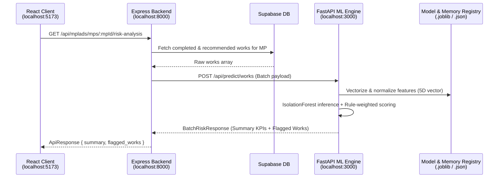

# FastAPI ML Service — API & Endpoints Specification

> **Service Name:** `mplads-risk-analytics` (Model 2: Project Execution Delay & Risk Engine)  
> **Default Port:** `3000` (Configurable via `ML_PORT` in `.env`)  
> **CORS Policy:** Restricted to Express backend (`http://localhost:8000`)  
> **Framework:** FastAPI (Python 3.13 / Uvicorn)  
> **Location:** `ML Research and docs/FASTAPI_ENDPOINTS_API_SPEC.md`

---

## 1. System Architecture & Communication Flow

The ML service is designed as an isolated internal microservice. It is **not** exposed directly to the public browser; instead, the Node.js / Express backend acts as an API gateway and reverse proxy.



---

## 2. Environment Configuration

The service reads configuration from `mplads-risk-analytics/.env`:

| Key | Default Value | Description |
|:---|:---|:---|
| `ML_PORT` | `3000` | Local port for FastAPI Uvicorn server |
| `ML_HOST` | `0.0.0.0` | Bind host address |
| `ALLOWED_ORIGINS` | `http://localhost:8000,http://127.0.0.1:8000` | Permitted CORS origins (Express proxy only) |
| `LOG_LEVEL` | `info` | Python logging level (`debug`, `info`, `warning`, `error`) |

---

## 3. Endpoints Overview

| Method | Endpoint | Description | Input Format | Output Format |
|:---|:---|:---|:---|:---|
| `GET` | `/health` | Service health & loaded model artifacts check | None | `HealthResponse` |
| `POST` | `/api/predict/work` | Real-time risk analysis for an individual project | `WorkInput` | `WorkRiskResponse` |
| `POST` | `/api/predict/works` | Batch risk analysis for multiple projects (MP/District) | `BatchWorkInput` or `List[WorkInput]` | `BatchRiskResponse` |
| `GET` | `/` | Service root and interactive docs link | None | JSON |
| `GET` | `/docs` | Swagger UI interactive OpenAPI documentation | Browser | HTML |

---

## 4. Detailed Endpoint Specifications

### 4.1. `GET /health`
Verifies that the ML model, scalers, and statistical dictionaries are loaded in memory and ready for low-latency inference.

#### Response (`200 OK`)
```json
{
  "status": "healthy",
  "version": "1.0.0",
  "model_loaded": true,
  "artifacts": {
    "model": "IsolationForest (n_estimators=150, contamination=0.10)",
    "scaler": "StandardScaler (5 features)",
    "category_count": 5,
    "mp_count": 765
  }
}
```

---

### 4.2. `POST /api/predict/work` (Single Work Analysis)
Analyzes an individual project work and produces an execution risk score, compliance classification, engineered metrics, diagnostic tags, and an actionable audit recommendation.

#### Request Body (`WorkInput`)
```json
{
  "work_id": 134703,
  "work_description": "Upgradation of Road from Madhavaram Village to Company Indlu",
  "category": "Normal/Others",
  "mp_name": "DAGGUMALLA PRASADA RAO",
  "constituency": "CHITTOOR",
  "ida": "CHITTOOR(DISTRICT COLLECTOR CHITTOOR_IDA)",
  "recommended_amount": 350000.0,
  "final_amount": 499993.0,
  "recommendation_date": "2024-01-10T00:00:00.000Z",
  "completed_date": "2025-01-31T00:00:00.000Z",
  "has_images": false
}
```

#### Response (`200 OK` — `WorkRiskResponse`)
```json
{
  "work_id": 134703,
  "execution_risk_score": 60.5,
  "risk_level": "MODERATE_RISK",
  "is_compliant": false,
  "metrics": {
    "recommended_cost": 350000.0,
    "final_settled_cost": 499993.0,
    "cost_escalation_pct": "+42.85%",
    "cost_escalation_ratio": 1.4286,
    "execution_duration_days": 387,
    "has_photo_evidence": false,
    "mp_completion_rate_pct": 51.63,
    "category_z_score": -0.04
  },
  "flagged_reasons": [
    "Missing Mandatory Proof: Project signed off as completed with NO photographic evidence (Has Images = False)",
    "Cost Escalation: Final settled cost exceeded recommended estimate by +42.85% (₹149,993 overrun)",
    "Prolonged Duration: Project took 387 days against state average benchmark of 180 days"
  ],
  "explainability_tags": [
    "ZERO_PHOTO_EVIDENCE",
    "COST_OVERRUN",
    "CHRONIC_DELAY"
  ],
  "recommended_action": "Issue administrative query for cost/duration variance before final accounting closure."
}
```

---

### 4.3. `POST /api/predict/works` (Batch Analysis)
Performs vectorized batch scoring for an entire MP portfolio or district. It computes aggregate summary KPIs and filters flagged high/moderate risk projects.

#### Request Body (`BatchWorkInput` or `List[WorkInput]`)
```json
{
  "mp_name": "DAGGUMALLA PRASADA RAO",
  "constituency": "CHITTOOR",
  "works": [
    {
      "work_id": 134703,
      "work_description": "Road Upgradation",
      "category": "Normal/Others",
      "recommended_amount": 350000.0,
      "final_amount": 499993.0,
      "recommendation_date": "2024-01-10T00:00:00.000Z",
      "completed_date": "2025-01-31T00:00:00.000Z",
      "has_images": false
    },
    {
      "work_id": 134704,
      "work_description": "Community Hall Construction",
      "category": "Normal/Others",
      "recommended_amount": 500000.0,
      "final_amount": 495000.0,
      "recommendation_date": "2024-06-01T00:00:00.000Z",
      "completed_date": "2024-09-29T00:00:00.000Z",
      "has_images": true
    }
  ]
}
```

#### Response (`200 OK` — `BatchRiskResponse`)
```json
{
  "summary": {
    "total_works": 2,
    "average_risk_score": 40.0,
    "high_risk_count": 0,
    "moderate_risk_count": 1,
    "compliant_count": 1,
    "missing_photos_count": 1,
    "cost_overrun_works_count": 1,
    "delayed_works_count": 1,
    "total_recommended_amount": 850000.0,
    "total_final_amount": 994993.0,
    "total_cost_overrun_amount": 149993.0
  },
  "flagged_works": [
    {
      "work_id": 134703,
      "execution_risk_score": 60.5,
      "risk_level": "MODERATE_RISK",
      "is_compliant": false,
      "metrics": {
        "recommended_cost": 350000.0,
        "final_settled_cost": 499993.0,
        "cost_escalation_pct": "+42.85%",
        "cost_escalation_ratio": 1.4286,
        "execution_duration_days": 387,
        "has_photo_evidence": false,
        "mp_completion_rate_pct": 51.63,
        "category_z_score": -0.04
      },
      "flagged_reasons": [
        "Missing Mandatory Proof: Project signed off as completed with NO photographic evidence (Has Images = False)",
        "Cost Escalation: Final settled cost exceeded recommended estimate by +42.85% (₹149,993 overrun)",
        "Prolonged Duration: Project took 387 days against state average benchmark of 180 days"
      ],
      "explainability_tags": [
        "ZERO_PHOTO_EVIDENCE",
        "COST_OVERRUN",
        "CHRONIC_DELAY"
      ],
      "recommended_action": "Issue administrative query for cost/duration variance before final accounting closure."
    }
  ],
  "all_works": [
    {
      "work_id": 134703,
      "execution_risk_score": 60.5,
      "risk_level": "MODERATE_RISK",
      "is_compliant": false,
      "metrics": { ... },
      "flagged_reasons": [ ... ],
      "explainability_tags": [ ... ],
      "recommended_action": "..."
    },
    {
      "work_id": 134704,
      "execution_risk_score": 19.5,
      "risk_level": "COMPLIANT_LOW_RISK",
      "is_compliant": true,
      "metrics": {
        "recommended_cost": 500000.0,
        "final_settled_cost": 495000.0,
        "cost_escalation_pct": "-1.00%",
        "cost_escalation_ratio": 0.99,
        "execution_duration_days": 120,
        "has_photo_evidence": true,
        "mp_completion_rate_pct": 51.63,
        "category_z_score": -0.05
      },
      "flagged_reasons": [],
      "explainability_tags": [
        "VERIFIED_PHOTOS",
        "BUDGET_COMPLIANT",
        "ON_TIME_COMPLETION"
      ],
      "recommended_action": "Standard audit closure approved."
    }
  ]
}
```

---

## 5. Scoring Logic & Classification Engine

### Feature Extraction (5-Dimensional Vector)
1. **`cost_escalation_ratio`** = $\text{Final Amount} / \max(\text{Recommended Amount}, 1.0)$  
2. **`execution_days`** = $(\text{Completed Date} - \text{Recommendation Date})\text{ in days}$  
3. **`missing_photo_penalty`** = $1.0\text{ if }\text{has\_images} = \text{False, else } 0.0$  
4. **`mp_completion_rate`** = Historical completion rate % for the recommending MP  
5. **`category_cost_deviation`** = $(\text{Final Amount} - \mu_{\text{category}}) / \sigma_{\text{category}}$ (Z-Score)

### Hybrid Scoring Formula
$$\text{Risk Score} = \text{Clip}\left(0.45 \times \text{Base ML Anomaly} + 0.55 \times \text{Governance Rule Penalty},\; 0.0,\; 100.0\right)$$

### Risk Tiers & Actions

| Score Range | Classification | Compliance | Action Triggered |
|:---|:---|:---:|:---|
| **`0.0 – 30.9`** | `COMPLIANT_LOW_RISK` | ✅ Passed | Standard audit closure approved. |
| **`31.0 – 69.9`** | `MODERATE_RISK` | ⚠️ Conditional | Issue administrative audit notice for cost/duration variance. |
| **`70.0 – 100.0`** | `HIGH_EXECUTION_RISK` | ❌ Flagged | Withhold contractor final retention & order vigilance inspection. |

---

## 6. Testing & Invocation Examples

### Test with PowerShell
```powershell
# Health check
Invoke-RestMethod -Uri "http://localhost:3000/health" -Method Get

# Single work prediction
$body = @{
    work_id = 134703
    recommended_amount = 350000
    final_amount = 499993
    recommendation_date = "2024-01-10T00:00:00.000Z"
    completed_date = "2025-01-31T00:00:00.000Z"
    has_images = $false
} | ConvertTo-Json

Invoke-RestMethod -Uri "http://localhost:3000/api/predict/work" -Method Post -Body $body -ContentType "application/json"
```

### Test with Python `requests`
```python
import requests

payload = {
    "mp_name": "DAGGUMALLA PRASADA RAO",
    "works": [
        {
            "work_id": 134703,
            "recommended_amount": 350000.0,
            "final_amount": 499993.0,
            "recommendation_date": "2024-01-10T00:00:00.000Z",
            "completed_date": "2025-01-31T00:00:00.000Z",
            "has_images": False
        }
    ]
}

res = requests.post("http://localhost:3000/api/predict/works", json=payload)
print(res.json())
```
