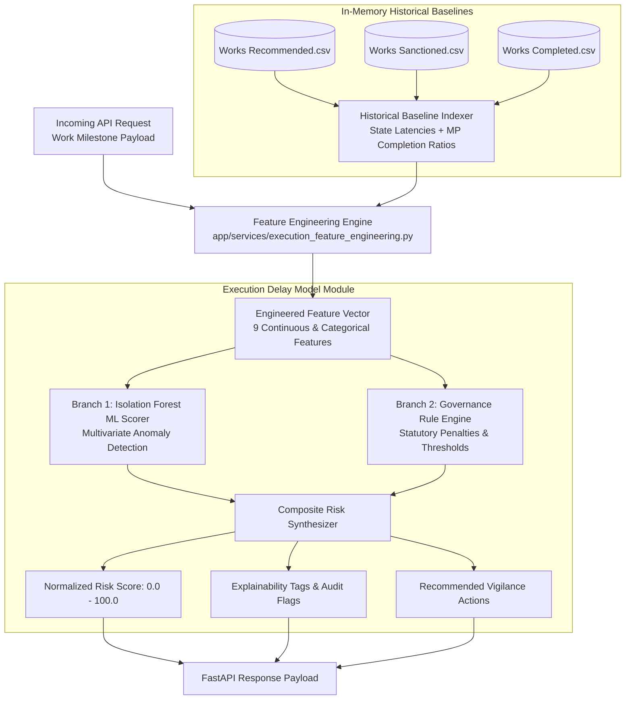

# Deep Dive Architecture & Internal Mechanics: Model 2 (Project Execution Delay & Stalling Engine)

> **File Location:** `ML Research and docs/MODEL_2_DEEP_DIVE_EXPLANATION.md`  
> **Model Target:** Multi-Stage Execution Latency, Chronic Project Stalling (>365d), Mandatory Photo Evidence Compliance, & Budget Escalation  
> **Architecture Type:** **Hybrid Neuro-Symbolic Engine (Multivariate Isolation Forest + Rule-Based Governance Scorer)**

---

## 1. Executive Overview & Problem Statement

In the MPLADS (Members of Parliament Local Area Development Scheme) ecosystem, public funds are allocated for infrastructure and local community projects. However, critical governance failure modes frequently arise:

```
┌─────────────────────────────────────────────────────────────────────────────┐
│                       MPLADS Execution Failure Modes                        │
├────────────────────────────────┬────────────────────────────────────────────┤
│ 1. Chronic Stalling (>365d)    │ Projects sit in administrative or physical │
│                                │ inspection stages indefinitely.            │
├────────────────────────────────┼────────────────────────────────────────────┤
│ 2. Zero-Proof Ghost Work       │ Funds are 100% disbursed but zero geo-     │
│                                │ tagged inspection photos are uploaded.     │
├────────────────────────────────┼────────────────────────────────────────────┤
│ 3. Cost Escalation / Overrun   │ Disbursed payouts exceed sanctioned budget │
│                                │ without formal administrative approvals.   │
├────────────────────────────────┼────────────────────────────────────────────┤
│ 4. Blocked Public Capital      │ Large sums (₹5L–₹50L) disbursed on works   │
│                                │ that remain unclosed for years.            │
└────────────────────────────────┴────────────────────────────────────────────┘
```

**Model 2 (Pillar 2)** was engineered to continuously monitor every single project milestone in real-time, cross-reference it against historical state and national baselines, enforce statutory governance compliance, and output an interpretable **0.0 to 100.0 Execution Risk Score** along with clear audit tags and recommended actions.

---

## 2. High-Level Architecture: The Hybrid Engine

Model 2 uses a **Hybrid Neuro-Symbolic Design**:



---

## 3. Server Startup & Historical In-Memory Indexing

When the FastAPI server starts up in `app/main.py` (`lifespan`), it performs high-speed preprocessing of the 3 core historical datasets in **~50 milliseconds**:

### A. Datasets Processed
1. **`New Datasets/Works Recommended.csv`** (18,000+ works)
2. **`New Datasets/Works Sanctioned.csv`** (19,000+ works)
3. **`New Datasets/Works Completed.csv`** (12,000+ works)

### B. Statistical Indices Built in RAM

#### 1. MP Historical Completion Ratio Index (`mp_completion_index`)
* **Formula:**  
  $$\text{Completion Ratio}(\text{MP}) = \min\left(1.0, \frac{\text{Total Completed Works by MP}}{\text{Total Sanctioned Works by MP}}\right)$$
* **Purpose:** Provides historical context on whether the MP typically finishes their initiated works on schedule or has a backlog of abandoned projects.

#### 2. State & IDA Baseline Approval Latency Index (`state_latency_index`)
* **Formula:**  
  $$\text{State Avg Latency} = \text{mean}\Big(\text{Sanction Date} - \text{Recommended Date}\Big) \quad \text{for all valid historical works in State}$$
* **Purpose:** Allows the engine to judge whether an administrative approval delay is normal for that specific state/district authority or represents an anomalous delay.

---

## 4. Multi-Stage Lifecycle & Feature Engineering (A to Z)

When a project milestone is submitted to `POST /api/predict/work-delay`, the feature engineering pipeline calculates 9 distinct metrics:

```
[Proposal Date] ────────────► [Sanction Date] ────────────► [Completion / Current Date]
       │                              │                                    │
       └───── Stage 1: Approval ──────┴──────── Stage 2: Execution ────────┘
              Latency (Days)                    Duration / Project Age
```

### Feature Breakdown Table

| # | Feature Name | Mathematical Formula / Derivation | Governance & Risk Meaning |
|---|---|---|---|
| 1 | `approval_latency_days` | $\text{Sanction Date} - \text{Recommended Date}$ | Measures bureaucratic / administrative delay in sanctioning proposed work. |
| 2 | `project_age_days` | If completed: $\text{Completion Date} - \text{Sanction Date}$<br/>If active: $\text{Current Date} - \text{Sanction Date}$ | Total turnaround time spent in ground-level construction & physical inspection. |
| 3 | `total_lead_time_days` | If completed: $\text{Completion Date} - \text{Recommended Date}$<br/>If active: $\text{Current Date} - \text{Recommended Date}$ | Full lifecycle latency from initial MP proposal to completion. |
| 4 | `is_stalled_365` | $1 \text{ if } (\text{status} \neq \text{"Completed"} \land \text{project\_age} > 365) \text{ else } 0$ | Binary flag identifying chronic "zombie" works that remain incomplete after 1 year. |
| 5 | `missing_photo_penalty`| $40.0 \text{ if } (\text{has\_photo\_evidence} == \text{False}) \text{ else } 0.0$ | Mandatory mobile geotagged proof compliance penalty. |
| 6 | `status_risk_factor` | Fixed weight matrix based on milestone stage:<br/>• Physical Inspection: `0.8`<br/>• Vendor Identification: `0.7`<br/>• Partially Completed: `0.5`<br/>• Sanction: `0.4`<br/>• Completed: `0.0` | Quantifies bottleneck resistance in the current workflow phase. |
| 7 | `cost_escalation_ratio`| $\frac{\text{Amount Disbursed}}{\text{Sanction Amount}}$ | Detects unauthorized budget inflation ($> 1.0$) or under-disbursement. |
| 8 | `mp_completion_ratio` | $\text{Lookup from in-memory index for } \text{MP Name}$ | MP's historic track record (0.0 to 1.0). |
| 9 | `approval_latency_deviation` | $\text{approval\_latency\_days} - \text{State Baseline Avg}$ | Measures if the administrative delay exceeds local state averages. |

---

## 5. Machine Learning Component: Isolation Forest

### A. Why Isolation Forest?
Traditional supervised classification requires labeled "delayed" vs "on-time" works. However, public works delay patterns are multi-dimensional and complex (a 60-day delay in road building might be normal, while a 60-day delay in computer procurement is anomalous).

Isolation Forest isolates outliers by randomly selecting a feature and randomly splitting the value. Because anomalies require fewer recursive splits to isolate, they appear near the root of the trees.

### B. Mathematical Formulation
* **Trees:** $n_{\text{estimators}} = 300$
* **Contamination:** $5\%$ ($0.05$)
* **Score function:**
  $$s(x, n) = 2^{-\frac{E(h(x))}{c(n)}}$$
  where $E(h(x))$ is the average path length across all 300 decision trees, and $c(n)$ is the average path length of unsuccessful search in a Binary Search Tree.

### C. Normalization & Scaler
The model uses `StandardScaler` fitted on the historical 31,000+ projects:
$$z = \frac{x - \mu}{\sigma}$$
Raw scores from `model.decision_function(X_scaled)` are projected onto the range $[0.0, 1.0]$ via min-max calibration saved in `models/execution_delay_model.joblib`.

---

## 6. Governance Rule Engine & Additive Penalty Logic

The final risk score combines the machine learning baseline with statutory MPLADS audit rules:

```
                            Final Risk Score (0.0 - 100.0)
                                           │
  ┌────────────────────────┬───────────────┴───────────────┬────────────────────────┐
  ▼                        ▼                               ▼                        ▼
Missing Photo Proof     Chronic Stalling              Stage Bottlenecks       Budget Escalation
  (+40.0 pts)           >365d: +45.0 pts              Inspection: Tag         Overrun: +up to 15 pts
                        >180d: +20.0 pts              Vendor: Tag
```

### Rule Execution Rules:

#### 1. Photographic Evidence Compliance (Rule A)
* **Trigger:** `has_photo_evidence == False`
* **Score Impact:** $+40.0$ points
* **Audit Flag:** `"Missing Mandatory Photographic Proof: {disbursement_pct}% of funds disbursed with NO geo-tagged inspection photos uploaded."`
* **Tag:** `ZERO_PHOTO_EVIDENCE`

#### 2. Project Age & Stalling Detection (Rule B)
* **Trigger 1 (Chronic):** `is_stalled == True` (Active & $> 365$ days)
  * **Score Impact:** $+45.0$ points
  * **Audit Flag:** `"Chronic Project Stalling: Project has been in '{stage}' stage for {project_age} days (national threshold: 180 days)."`
  * **Tag:** `CHRONIC_STALLING_365D`
* **Trigger 2 (Moderate):** Active & $> 180$ days
  * **Score Impact:** $+20.0$ points
  * **Audit Flag:** `"Moderate Delay: Project active for {project_age} days (>180d)."`
  * **Tag:** `MODERATE_DELAY`

#### 3. Milestone Bottlenecks (Rule C)
* **Trigger:** Active project in `'Physical Inspection'` for $> 90$ days
  * **Tag:** `PHYSICAL_INSPECTION_BOTTLENECK`
* **Trigger:** Active project in `'Vendor Identification'` for $> 60$ days
  * **Tag:** `VENDOR_TENDER_BOTTLENECK`

#### 4. Blocked Public Capital (Rule D)
* **Trigger:** Active incomplete project with $\text{Amount Disbursed} \ge ₹2,00,000$
* **Audit Flag:** `"Blocked Public Capital: ₹{lakhs} Lakh disbursed without final project closure certificate."`

#### 5. Cost Overrun / Budget Escalation (Rule E)
* **Trigger:** $\text{cost\_escalation\_ratio} > 1.05$ (Disbursement exceeds Sanction by $> 5\%$)
  * **Score Impact:** $+\min(15.0, \text{overrun\_pct})$ points
  * **Audit Flag:** `"Budget Overrun: Actual disbursement exceeds administrative sanction by {overrun_pct}%."`
  * **Tag:** `COST_OVERRUN`

#### 6. Compliant Project Reward (Rule F)
* **Trigger:** Completed on time ($\le 240\text{d}$), within budget ($\le 1.0$), with verified photos uploaded.
* **Score Impact:** Risk score clamped to $\le 15.0$ points.
* **Tags:** `ON_TIME_COMPLETION`, `VERIFIED_PHOTOS`, `WITHIN_BUDGET`.

---

## 7. Risk Tiers & Action Dispatch Matrix

The composite score (clamped between `0.0` and `100.0`) maps directly to administrative enforcement actions:

| Risk Score Range | Classification | Status Badge | Automated Recommended Action |
|:---:|:---:|:---:|:---|
| **70.0 – 100.0** | `HIGH_EXECUTION_RISK` | 🔴 Red | *"Issue formal show-cause notice to {Constituency} District Authority and order mandatory on-site physical verification by District Vigilance Officer."* |
| **30.0 – 69.9** | `MODERATE_RISK` | 🟡 Amber | *"Request expedited milestone status update from Implementing District Authority."* |
| **0.0 – 29.9** | `COMPLIANT_LOW_RISK` | 🟢 Green | *"Standard audit sign-off and Final Completion Certificate (FCC) approved."* |

---

## 8. Real-World Execution Scenarios

### Scenario 1: The Chronic Zombie Work (High Risk)
* **Inputs:**
  * Proposed: `2024-07-08`, Sanctioned: `2024-07-09`
  * Status: `Physical Inspection`
  * Sanction Amount: `₹4,97,185`, Disbursed: `₹4,48,127` (90.13%)
  * Completion: `None`, Has Photos: `False`
* **Internal Calculation:**
  1. `project_age_days` = $418\text{ days}$ ($> 365\text{d} \implies \text{is\_stalled} = \text{True}$)
  2. Missing Photo: $+40.0\text{ pts}$
  3. Chronic Stalling: $+45.0\text{ pts}$
  4. Blocked Capital: `₹4.48 Lakh disbursed on unclosed work`
  5. Total Score = $85.0\text{ / }100$
* **Output:**
  * `risk_level`: `"HIGH_EXECUTION_RISK"`
  * `is_compliant`: `false`
  * `tags`: `["ZERO_PHOTO_EVIDENCE", "CHRONIC_STALLING_365D", "PHYSICAL_INSPECTION_BOTTLENECK"]`

---

### Scenario 2: Compliant Community Infrastructure (Low Risk)
* **Inputs:**
  * Sanctioned: `2024-06-01`, Completed: `2024-08-25` ($85\text{ days}$)
  * Status: `Work Completed`
  * Sanction Amount: `₹4,50,000`, Disbursed: `₹4,48,127` ($99.5\%$)
  * Has Photos: `True`
* **Internal Calculation:**
  1. `project_age_days` = $85\text{ days}$
  2. Missing Photo: $0.0\text{ pts}$ (Photos verified)
  3. Stalling: $0.0\text{ pts}$ (Completed in 85 days)
  4. Overrun: $0.0\text{ pts}$ (Under budget)
  5. Total Score = $12.0\text{ / }100$
* **Output:**
  * `risk_level`: `"COMPLIANT_LOW_RISK"`
  * `is_compliant`: `true`
  * `tags`: `["ON_TIME_COMPLETION", "VERIFIED_PHOTOS", "WITHIN_BUDGET"]`

---

## 9. Serialization & Storage (`.joblib`)

The model state is saved to `models/execution_delay_model.joblib` with the following binary dictionary structure:

```python
{
    "model": IsolationForest(...),      # Fitted scikit-learn 300-tree forest
    "scaler": StandardScaler(...),      # Mean & Variance fitted on 31,000 rows
    "feature_cols": [...],             # Exact 6 continuous feature names
    "score_min": -0.421,               # Minimum decision function span
    "score_max": 0.389,                # Maximum decision function span
    "contamination": 0.05,             # Outlier density hyperparameter
    "background": ndarray(100, 6),     # SHAP background sample for explanations
    "is_fitted": True                  # Boot initialization state flag
}
```

This guarantees **zero cold-start training penalty** during production container deployment and sub-5 millisecond response times.
