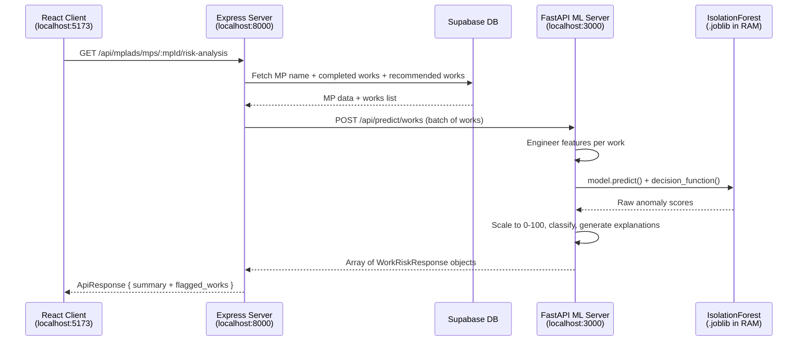

# Model 2 Integration — Resolved Design Decisions & Updated Plan

> **Status**: Open questions resolved from user review. Ready for implementation approval.  
> **Last Updated**: 2026-08-28

---

## Resolved Decisions (From User Review)

### 1. CORS Policy — FastAPI accepts requests ONLY from Express

> [!IMPORTANT]
> FastAPI CORS is locked to **Express server only** (`localhost:8000`). The React client (`localhost:5173`) does **NOT** talk to FastAPI directly — all ML requests go through the Express proxy layer.

**Why this matters**: Single point of entry. The client never knows about the ML server. If FastAPI moves to a different host/port in production, only the Express `.env` needs updating.

```
Browser ──→ Express (:8000) ──→ FastAPI (:3000)
   ✅            ✅                  ❌ (no direct client access)
```

**Impact on code**:
- `app/main.py` CORS origins list: `["http://localhost:8000"]` only
- No `localhost:5173` in FastAPI allowed origins

---

### 2. Model Training — `train_models.py` IS required

> [!IMPORTANT]
> The `.joblib` model artifacts do **not exist yet**. The `train_models.py` script must be created as part of this implementation to generate:
> - `execution_model.joblib` — Trained Isolation Forest model
> - Category-level statistics (mean/std per category for z-score calculation)

**Impact on plan**: `train_models.py` is now a **blocking prerequisite** — must run before FastAPI server can boot.

**Training pipeline**:
```
Datasets/mplads_completed_works_*.csv  ─┐
                                        ├──→ train_models.py ──→ execution_model.joblib
Datasets/mplads_recommended_works_*.csv ─┘                  ──→ category_stats.json
                                                            ──→ mp_completion_rates.json
```

**Artifacts generated** (saved to `mplads-risk-analytics/models/`):

| File | Purpose |
|:---|:---|
| `execution_model.joblib` | Trained IsolationForest model |
| `scaler.joblib` | Fitted StandardScaler for feature normalization |
| `category_stats.json` | Per-category mean/std of `final_amount` (for z-score calc) |
| `mp_completion_rates.json` | Per-MP completion rate lookup (completed/recommended × 100) |

---

### 3. Inference Strategy — Live inference, NO pre-scored CSV

> [!IMPORTANT]
> Tab 4 uses **live model inference** for every work. There is no `scored_works.csv` pre-computation. Every time the risk analysis tab is loaded, the Express server fetches the MP's works from Supabase, sends them to FastAPI, and gets real-time scores back.

**Why this matters**:
- Scores always reflect the latest model state
- No stale data from batch scoring
- Enables the "Risk Simulator" use case from the IO spec (future)

**Impact on architecture**:

```diff
- FastAPI loads scored_works.csv at startup and does lookups
+ FastAPI runs live .predict() on incoming work data every time
```

**Updated data flow for Tab 4**:
```
1. Express receives GET /api/mplads/mps/:mpId/risk-analysis
2. Express queries Supabase for MP's completed_works + matching recommended_works
3. Express sends batch of works to FastAPI POST /api/predict/works (batch endpoint)
4. FastAPI engineers features → runs model.predict() → returns scored results
5. Express wraps in ApiResponse and returns to client
```

> [!WARNING]
> **Performance consideration**: For MPs with 100+ works, batch inference needs to be fast. Isolation Forest `.predict()` on pre-engineered features should complete in <50ms for 200 works. If slow, we can add pagination to the risk analysis endpoint later.

---

### 4. FastAPI Port — `3000` locally, configurable via `.env`

> [!IMPORTANT]
> FastAPI runs on **port 3000** in local development. Port is read from `.env` file, not hardcoded.

**Configuration**:

| Variable | Location | Default |
|:---|:---|:---|
| `ML_PORT` | `mplads-risk-analytics/.env` | `3000` |
| `ML_API_URL` | `MPLADwebapp/server/.env` | `http://localhost:3000` |

---

## Updated Architecture (Post-Review)



---

## Updated File Manifest

### Phase 0: Model Training (run once)

| Action | File | Description |
|:---|:---|:---|
| **[NEW]** | `mplads-risk-analytics/train_models.py` | Training script — reads CSVs, engineers features, trains IsolationForest, saves artifacts |
| **[NEW]** | `mplads-risk-analytics/models/` | Output directory for `.joblib` and `.json` artifacts |

### Phase 1: FastAPI ML Server

| Action | File | Description |
|:---|:---|:---|
| **[NEW]** | `mplads-risk-analytics/requirements.txt` | `fastapi`, `uvicorn`, `pandas`, `numpy`, `scikit-learn`, `joblib`, `pydantic` |
| **[NEW]** | `mplads-risk-analytics/.env` | `ML_PORT=3000` |
| **[NEW]** | `mplads-risk-analytics/app/__init__.py` | Package init |
| **[NEW]** | `mplads-risk-analytics/app/main.py` | FastAPI app — CORS (Express only), loads model on startup |
| **[NEW]** | `mplads-risk-analytics/app/models/loader.py` | Loads `.joblib` + stats files into memory |
| **[NEW]** | `mplads-risk-analytics/app/schemas/work.py` | Pydantic request/response models |
| **[NEW]** | `mplads-risk-analytics/app/routers/predict.py` | `POST /api/predict/work`, `POST /api/predict/works` (batch), `GET /health` |
| **[NEW]** | `mplads-risk-analytics/app/services/scoring.py` | Feature engineering + model inference + explainability |

### Phase 2: Express Backend Proxy

| Action | File | Description |
|:---|:---|:---|
| **[MODIFY]** | `MPLADwebapp/server/controllers/mplads.controller.js` | Replace 501 stub with real proxy to FastAPI |
| **[MODIFY]** | `MPLADwebapp/server/.env.example` | Add `ML_API_URL=http://localhost:3000` |

### Phase 3: React Frontend — Tab 4

| Action | File | Description |
|:---|:---|:---|
| **[NEW]** | `client/src/components/risk/RiskAnalysisTab.jsx` | Tab 4 container — fetches data, handles loading/error/offline states |
| **[NEW]** | `client/src/components/risk/RiskScoreGauge.jsx` | Circular gauge component (green/amber/red) |
| **[NEW]** | `client/src/components/risk/RiskSummaryCard.jsx` | Aggregate stats card with breakdown pills |
| **[MODIFY]** | `client/src/screens/MPPortfolioScreen.jsx` | Add Tab 4 to MP detail page tabs |

---

## Execution Order

```
1. train_models.py        → generates .joblib artifacts (BLOCKING)
2. FastAPI server files   → boots on :3000, loads model
3. Express proxy          → connects to FastAPI at ML_API_URL
4. React Tab 4 components → renders risk data from Express
```
