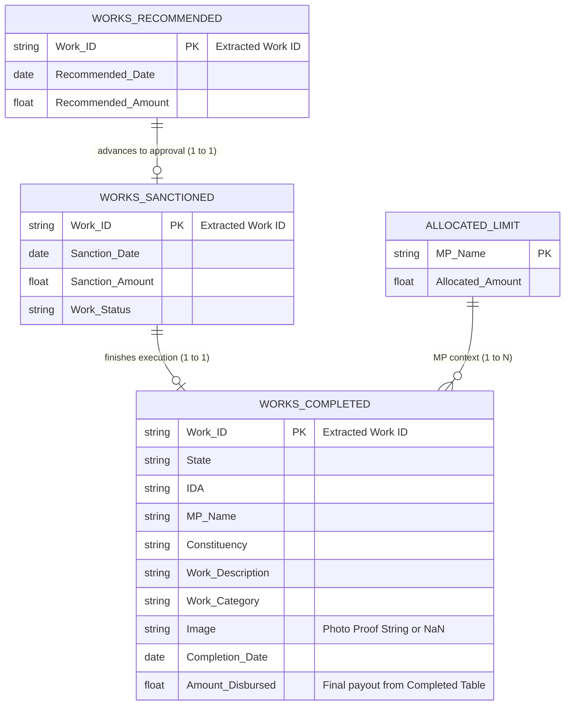

# Model Specification: Completed Works Audit & Compliance Engine (Expenditure-Free)

> **Model Identifier:** `MODEL_COMPLETED_WORKS_EXPENDITURE_FREE`  
> **Target Scope:** Auditing Completed MPLADS Projects, Physical Execution Latency, Zero-Proof Payout Verification, & Cost Escalation Variance  
> **Source Datasets (3 CSVs):** `Works Completed.csv`, `Works Sanctioned.csv`, `Works Recommended.csv` (Optionally joined with `Allocated Limit for Honble MPs (2).csv`)  
> **Excluded Dataset:** `Expenditure on Completed and On-going Works as on Date.csv` (No voucher/transaction level dependency required)  
> **Location:** `ML Research and docs/MODEL_COMPLETED_WORKS_SPEC.md`  

---

## 1. Executive Summary & Design Rationale

While traditional financial audit engines rely on itemized payment transaction vouchers, many real-world administrative pipelines need a **lean, post-execution completion audit model** that operates strictly on project sign-off records without needing the 59,000-row expenditure transaction ledger.

This specification details the **Completed Works Audit & Compliance Engine**. By performing a 3-way relational join across `Works Completed.csv` (12,000 works), `Works Sanctioned.csv` (19,000 works), and `Works Recommended.csv` (18,000 works), the model extracts full lifecycle turnaround times, computes sanction-vs-disbursement cost escalation, checks mobile photo evidence presence, and detects anomalous sign-offs using a hybrid **Isolation Forest + Governance Penalty Engine**.

---

## 2. Dataset Relational Connection (No Expenditure Table)



### Relational Join Key Rules
1. **Primary Join Key:** `Work ID` (Extracted from the compound field `Work` e.g., `WS/MP620/2024-2025/133166`).
2. **Secondary Validation Keys:** `State`, `IDA`, `Hon'ble Members of Parliament`.
3. **No Expenditure Dependency:** All financial metrics utilize `Sanction Amount ( ₹ )` from `Works Sanctioned` and `Amount Disbursed ( ₹ )` directly from `Works Completed`.

---

## 3. Feature Engineering Pipeline

From the 3 joined tables, the feature pipeline computes 8 core numerical & categorical feature vectors:

| Feature Name | Dtype | Mathematical Formula / Extraction Logic | Governance Risk Target |
| :--- | :---: | :--- | :--- |
| `rec_to_sanc_days` | `Int` | `Sanction Date - Recommended Date` | Approval bottleneck (Normal: 0 to 120 days) |
| `sanc_to_comp_days` | `Int` | `Completion Date - Sanction Date` | Physical construction lag (Normal: 30 to 240 days) |
| `total_lead_time_days` | `Int` | `Completion Date - Recommended Date` | Total lifecycle turnaround time |
| `cost_escalation_ratio`| `Float`| `Amount Disbursed / Sanction Amount` | Cost overrun (>1.05) or severe under-disbursement (<0.50) |
| `rec_vs_disbursed_ratio`| `Float`| `Amount Disbursed / Recommended Amount` | Budget expansion from original MP proposal |
| `missing_photo_flag` | `Int` | `1 if (Image is NaN or Image != 'Images') else 0` | Heavy governance risk (35.63% missing photo proof!) |
| `is_instant_completion`| `Int` | `1 if (sanc_to_comp_days <= 7) else 0` | Paper sign-off anomaly (suspiciously fast completion) |
| `is_excessive_delay` | `Int` | `1 if (sanc_to_comp_days > 500) else 0` | Abnormal project duration anomaly |

---

## 4. Machine Learning & Scoring Architecture

The engine uses a **two-layer scoring model**:

```
                                  ┌───────────────────────────────┐
                                  │   Joined Completed Dataset    │
                                  └───────────────┬───────────────┘
                                                  │
                         ┌────────────────────────┴────────────────────────┐
                         ▼                                                 ▼
          ┌─────────────────────────────┐                   ┌─────────────────────────────┐
          │ Layer 1: Isolation Forest   │                   │ Layer 2: Rule & Compliance  │
          │ Evaluates 6-D vector for    │                   │ Evaluates Photo Evidence,   │
          │ multivariate statistical    │                   │ Instant Completion, and     │
          │ numerical anomalies.        │                   │ Severe Budget Escalation.   │
          └──────────────┬──────────────┘                   └──────────────┬──────────────┘
                         │                                                 │
                         └────────────────────────┬────────────────────────┘
                                                  ▼
                                 ┌─────────────────────────────────┐
                                 │ Composite Completed Work Risk   │
                                 │ Score (0 to 100)                │
                                 └─────────────────────────────────┘
```

### Layer 1: Multivariate Isolation Forest
* **Inputs:** [`sanc_to_comp_days`, `rec_to_sanc_days`, `total_lead_time_days`, `cost_escalation_ratio`, `rec_vs_disbursed_ratio`, `Amount Disbursed`]
* **Contamination Rate:** `0.05` (top 5% statistically unusual completions).
* **Output:** `anomaly_score_raw` normalized to $[0, 50]$ points.

### Layer 2: Rule & Governance Penalty Engine
* **Missing Photo Evidence Penalty:** $+35.0$ points if `missing_photo_flag == 1`.
* **Instant Completion Penalty:** $+25.0$ points if `is_instant_completion == 1`.
* **Severe Cost Overrun Penalty:** $+20.0$ points if `cost_escalation_ratio > 1.25`.
* **Unexplained Low Disbursement Penalty:** $+15.0$ points if `cost_escalation_ratio < 0.40` (project marked "completed" but < 40% funds disbursed).

### Composite Score Formula
$$\text{Completed Work Risk Score} = \min\left(100, \; \text{IsoForestScore} + \text{PhotoPenalty} + \text{InstantPenalty} + \text{EscalationPenalty} + \text{UnderDisbursePenalty}\right)$$

---

## 5. Risk Classification Bands

| Score Range | Risk Level | Meaning & Governance Recommendation |
| :---: | :--- | :--- |
| **0 – 30** | `COMPLIANT_COMPLETION` | Normal execution timeline, budget intact, photo evidence uploaded. |
| **31 – 65** | `MODERATE_RISK` | Moderate turnaround delay or slight cost escalation; minor audit flag. |
| **66 – 100** | `HIGH_GOVERNANCE_RISK` | Critical flag: Zero photo proof uploaded, instant paper sign-off, or massive budget overrun. |

---

## 6. Live API I/O Specification

### Request Endpoint
`POST /api/predict/completed-work`

### Request Payload (JSON)
```json
{
  "work_id": "WS/MP620/2024-2025/133166",
  "work_description": "Construction of Community Bhavan at Navalgund TQ Belavatagi Village",
  "work_category": "Normal/Others",
  "state": "Karnataka",
  "mp_name": "Pralhad Venkatesh Joshi",
  "constituency": "DHARWAD",
  "ida": "DHARWAD(DEPUTY COMMISSIONER DHARWAR_IDA)",
  "recommended_amount": 497185.0,
  "recommended_date": "2024-07-08",
  "sanction_amount": 497185.0,
  "sanction_date": "2024-07-09",
  "completion_date": "2024-09-05",
  "amount_disbursed": 448127.0,
  "has_photo_evidence": false
}
```

### Response Payload (JSON)
```json
{
  "work_id": "WS/MP620/2024-2025/133166",
  "completed_work_risk_score": 78.5,
  "risk_level": "HIGH_GOVERNANCE_RISK",
  "is_compliant": false,
  "metrics": {
    "recommended_amount": 497185.0,
    "sanction_amount": 497185.0,
    "amount_disbursed": 448127.0,
    "rec_to_sanc_days": 1,
    "sanc_to_comp_days": 58,
    "total_lead_time_days": 59,
    "cost_escalation_ratio": 0.9014,
    "has_photo_evidence": false
  },
  "flags": [
    {
      "code": "MISSING_PHOTO_EVIDENCE",
      "severity": "HIGH",
      "message": "Project marked completed and disbursed ₹4.48L without uploading mobile photographic proof."
    }
  ]
}
```

---

## 7. Python Implementation Script (Ready to Run)

Below is a self-contained Python pipeline that loads `Works Completed.csv`, `Works Sanctioned.csv`, and `Works Recommended.csv`, performs the join without the expenditure table, extracts features, trains an Isolation Forest, and outputs the top high-risk completed projects:

```python
import pandas as pd
import numpy as np
from sklearn.ensemble import IsolationForest

def build_completed_works_model(
    completed_csv="New Datasets/Works Completed.csv",
    sanctioned_csv="New Datasets/Works Sanctioned.csv",
    recommended_csv="New Datasets/Works Recommended.csv"
):
    # 1. Load Datasets & Clean Trailing Grand Total Rows
    df_comp = pd.read_csv(completed_csv).iloc[:-1]
    df_sanc = pd.read_csv(sanctioned_csv).iloc[:-1]
    df_rec = pd.read_csv(recommended_csv).iloc[:-1]

    # 2. Extract Work ID Key
    df_comp['work_id'] = df_comp['Work'].apply(lambda x: str(x).split('-')[0].strip())
    df_sanc['work_id'] = df_sanc['Work'].apply(lambda x: str(x).split('-')[0].strip())
    df_rec['work_id'] = df_rec['WORK'].apply(lambda x: str(x).split('-')[0].strip())

    # 3. Relational Join (No Expenditure Table)
    merged = df_comp.merge(
        df_sanc[['work_id', 'Sanction Date', 'Sanction Amount ( ₹ )']], 
        on='work_id', how='inner'
    ).merge(
        df_rec[['work_id', 'Recommended date', 'RECOMMENDED AMOUNT ( ₹ )']], 
        on='work_id', how='left'
    )

    # 4. Parsing Dates & Amounts
    merged['sanc_dt'] = pd.to_datetime(merged['Sanction Date'], format='%d-%b-%Y', errors='coerce')
    merged['comp_dt'] = pd.to_datetime(merged['Completion Date'], format='%d-%b-%y', errors='coerce')
    merged['rec_dt'] = pd.to_datetime(merged['Recommended date'], format='%d-%b-%Y', errors='coerce')

    merged['sanction_amt'] = pd.to_numeric(merged['Sanction Amount ( ₹ )'], errors='coerce')
    merged['disbursed_amt'] = pd.to_numeric(merged['Amount Disbursed ( ₹ )'], errors='coerce')
    merged['rec_amt'] = pd.to_numeric(merged['RECOMMENDED AMOUNT ( ₹ )'], errors='coerce')

    # 5. Feature Engineering
    merged['rec_to_sanc_days'] = (merged['sanc_dt'] - merged['rec_dt']).dt.days.fillna(0).clip(lower=0)
    merged['sanc_to_comp_days'] = (merged['comp_dt'] - merged['sanc_dt']).dt.days.fillna(0).clip(lower=0)
    merged['total_lead_time_days'] = (merged['comp_dt'] - merged['rec_dt']).dt.days.fillna(0).clip(lower=0)

    merged['cost_escalation_ratio'] = (merged['disbursed_amt'] / (merged['sanction_amt'] + 1)).fillna(1.0)
    merged['rec_vs_disbursed_ratio'] = (merged['disbursed_amt'] / (merged['rec_amt'] + 1)).fillna(1.0)
    merged['missing_photo_flag'] = merged['Image'].apply(lambda x: 1 if pd.isna(x) or str(x).strip() != 'Images' else 0)
    merged['is_instant_completion'] = (merged['sanc_to_comp_days'] <= 7).astype(int)

    # 6. Train Isolation Forest
    feature_cols = ['sanc_to_comp_days', 'rec_to_sanc_days', 'total_lead_time_days', 
                    'cost_escalation_ratio', 'rec_vs_disbursed_ratio', 'disbursed_amt']
    
    X = merged[feature_cols].fillna(0)
    iso = IsolationForest(n_estimators=100, contamination=0.05, random_state=42)
    raw_scores = -iso.fit_predict(X) * iso.score_samples(X)
    
    # Scale IsoForest Score to 0-50
    merged['iso_score'] = np.clip((raw_scores - raw_scores.min()) / (raw_scores.max() - raw_scores.min()) * 50, 0, 50)

    # 7. Composite Scoring Logic
    merged['photo_penalty'] = merged['missing_photo_flag'] * 35.0
    merged['instant_penalty'] = merged['is_instant_completion'] * 25.0
    merged['escalation_penalty'] = np.where(merged['cost_escalation_ratio'] > 1.25, 20.0, 0.0)

    merged['risk_score'] = np.clip(
        merged['iso_score'] + merged['photo_penalty'] + merged['instant_penalty'] + merged['escalation_penalty'],
        0, 100
    )

    return merged.sort_values(by='risk_score', ascending=False)

if __name__ == "__main__":
    results = build_completed_works_model()
    print("Top High Risk Completed Works:")
    print(results[['work_id', 'State', 'IDA', 'sanc_to_comp_days', 'missing_photo_flag', 'risk_score']].head(10))
```
