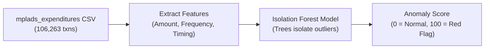

# Pillar 1: Financial & Expenditure Anomaly Engine

> **Focus:** Detecting Abnormal Spending Patterns, Invoice Splitting (Smurfing), & Fund Surges  
> **Core Algorithm:** **Isolation Forest (Unsupervised ML)**  
> **Directory:** `Ml research and docs/PILLAR_1_EXPENDITURE_ANOMALY.md`

---

## 1. WHY To Do It (The Problem)
* **Tender Evasion (Smurfing):** Corrupt actors split a ₹20 Lakh project into ten ₹1.99 Lakh invoices to bypass mandatory multi-tier administrative approvals.
* **Fiscal Rush / Dumping:** Unused funds suddenly dumped in bulk right before elections or fiscal year-ends without physical work.
* **Unusual Payout Amounts:** Paying ₹15 Lakh for basic minor repairs that normally cost ₹50,000.

---

## 2. WHAT To Do (The Objective)
* Train an **Isolation Forest** model on transactional data to assign an **Expenditure Anomaly Score (0 to 100)** for every transaction and MP.
* Flag transactions with high anomaly scores for manual auditor review.

---

## 3. HOW To Do It (Step-by-Step)



### Step 1: Input Datasets
* [`mplads_expenditures_2026-08-22.csv`](file:///c:/Users/DIVYA/OneDrive/Desktop/3_Projects_and_Development/Projects/SIH/mplads-risk-analytics/Datasets/mplads_expenditures_2026-08-22.csv) (106,263 transactions)
* [`mplads_mp_summary_2026-08-22.csv`](file:///c:/Users/DIVYA/OneDrive/Desktop/3_Projects_and_Development/Projects/SIH/mplads-risk-analytics/Datasets/mplads_mp_summary_2026-08-22.csv) (764 MPs)

### Step 2: Key Features Extracted
1. `Expenditure Amount`: Transaction value in ₹.
2. `Near_Threshold_Flag`: 1 if amount is between ₹1.90L–₹1.999L or ₹4.90L–₹4.999L, else 0.
3. `MP_Monthly_Txn_Frequency`: Number of transactions cleared by the MP in that specific month.
4. `Days_Since_Last_Txn`: Velocity of disbursements.
5. `Amount_to_MP_Total_Ratio`: Transaction amount as a % of the MP’s total allocated budget.

### Step 3: Run Model & Scoring
* Fit `IsolationForest(n_estimators=100, contamination=0.03)` on the feature matrix.
* Convert decision function into normalized **Risk Score (0–100)**:
  * **0–30:** Normal Transaction
  * **31–70:** Moderate Anomaly
  * **71–100:** Critical Red Flag (Threshold Skimming / Sudden Surge)

---

## 4. Real Evidence in Our Dataset
* **106,263 total transactions.**
* The **exact median transaction is ₹1,99,999.00**—proving that contractors deliberately structure payments ₹1 below the ₹2 Lakh threshold.
* Multiple MPs have 1,400+ transactions while others have fewer than 10.

---

## 5. Hackathon Talking Point (For Judges)
> *"We use Isolation Forest to catch multi-dimensional financial anomalies like invoice splitting and fiscal year dumping without needing historical fraud labels. It instantly caught that the median transaction across 106,000 records is ₹1,99,999—a classic threshold-evasion signature."*

---

## 6. References & Verification Commands

### 📂 Dataset Source References
* **File:** [`mplads_expenditures_2026-08-22.csv`](file:///c:/Users/DIVYA/OneDrive/Desktop/3_Projects_and_Development/Projects/SIH/mplads-risk-analytics/Datasets/mplads_expenditures_2026-08-22.csv)
  * Columns: `Expenditure Amount (₹)`, `Expenditure Date`, `Payment Status`, `Vendor`, `IDA`
* **File:** [`mplads_mp_summary_2026-08-22.csv`](file:///c:/Users/DIVYA/OneDrive/Desktop/3_Projects_and_Development/Projects/SIH/mplads-risk-analytics/Datasets/mplads_mp_summary_2026-08-22.csv)
  * Columns: `Allocated Amount (₹)`, `Total Expenditure (₹)`, `Utilization %`, `Transaction Count`

### 💻 Python Command to Cross-Check Numbers
Run this in PowerShell / Python to verify the exact numbers:
```python
import pandas as pd
df = pd.read_csv(r"Datasets/mplads_expenditures_2026-08-22.csv", encoding="utf-8")
print(f"Total Transactions: {len(df):,}")
print(f"Median Amount: ₹{df['Expenditure Amount (₹)'].median():,.2f}")
print("Amounts exactly equal to 199999.0:", (df['Expenditure Amount (₹)'] == 199999.0).sum())
print("Amounts between 1.90L and 2.00L:", ((df['Expenditure Amount (₹)'] >= 190000) & (df['Expenditure Amount (₹)'] <= 200000)).sum())
```

### 📖 Policy & Academic References
1. **MoSPI MPLADS Guidelines (2023 Revision):** Sections 3.2 & 4.1 on Administrative Sanctions and Financial Ceilings for fast-track approvals under ₹2.00 Lakh.
2. **CAG (Comptroller and Auditor General of India) Report on MPLADS:** Findings on fiscal dumping in terminal years and splitting of sanctions to bypass technical approvals.
3. **Liu, F. T., Ting, K. M., & Zhou, Z. H. (2008):** *"Isolation Forest."* IEEE International Conference on Data Mining (ICDM), pp. 413-422.

