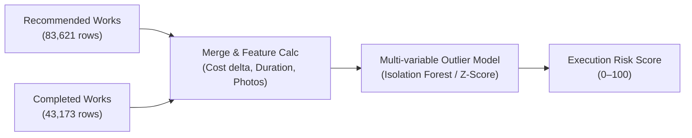

# Pillar 2: Project Execution Delay & Cost Overrun Engine

> **Focus:** Stalled Projects, Inflated Final Costs, & Unverified Zero-Proof Completions  
> **Core Algorithm:** **Multi-variate Outlier Scorer / Isolation Forest**  
> **Directory:** `Ml research and docs/PILLAR_2_PROJECT_DELAY_AND_COST_OVERRUN.md`

---

## 1. WHY To Do It (The Problem)
* **Cost Escalation Fraud:** Work estimated at ₹2 Lakh ends up being settled at ₹10 Lakh without documented scope changes.
* **Chronic Delays:** Projects recommended years ago that remain "in-progress" while funds sit blocked.
* **Paper-Only Completions (Ghost Sign-Offs):** Works signed off as completed and paid out, but lacking mandatory photo/geo-tagged evidence.

---

## 2. WHAT To Do (The Objective)
* Compare estimated costs vs final settled amounts, calculate execution lead times, check photo compliance, and assign an **Execution Risk Score (0–100)** to every project.

---

## 3. HOW To Do It (Step-by-Step)



### Step 1: Input Datasets
* [`mplads_recommended_works_2026-08-22.csv`](file:///c:/Users/DIVYA/OneDrive/Desktop/3_Projects_and_Development/Projects/SIH/mplads-risk-analytics/Datasets/mplads_recommended_works_2026-08-22.csv) (83,621 rows)
* [`mplads_completed_works_2026-08-22.csv`](file:///c:/Users/DIVYA/OneDrive/Desktop/3_Projects_and_Development/Projects/SIH/mplads-risk-analytics/Datasets/mplads_completed_works_2026-08-22.csv) (43,173 rows)
* [`mplads_mp_summary_2026-08-22.csv`](file:///c:/Users/DIVYA/OneDrive/Desktop/3_Projects_and_Development/Projects/SIH/mplads-risk-analytics/Datasets/mplads_mp_summary_2026-08-22.csv) (764 rows)

### Step 2: Key Features Extracted
1. `Cost_Escalation_Ratio`: `Final Amount / Recommended Amount` (Flags > 1.5x increases).
2. `Execution_Duration_Days`: `Completed Date - Recommendation Date`.
3. `No_Photo_Penalty`: High risk penalty if `Has Images == False` on completed works.
4. `MP_Completion_Rate`: Overall MP project delivery track record (`Completed / Recommended * 100`).

### Step 3: Run Model & Scoring
* Scale and evaluate multivariate outlier scores.
* Outputs **Execution Risk Score (0–100)**:
  * **0–30:** Completed on time, within budget, verified with photo.
  * **31–70:** Minor cost variance or moderate execution delay.
  * **71–100:** Severe cost overrun, stalled indefinitely, or completed with zero photo proof.

---

## 4. Real Evidence in Our Dataset
* **12,747 completed works (29.5%)** have `Has Images = False`—over ₹690 Crore disbursed with **zero photo verification**.
* **99.75%** of recommended works lack baseline photo documentation at submission.
* 40,448 recommended projects are currently pending/stalled nationally.

---

## 5. Hackathon Talking Point (For Judges)
> *"Our execution engine automatically pinpoints physical monitoring deficits. In our dataset, nearly 30% of completed projects were paid out with zero photographic proof. The system flags these governance gaps before final audit closure."*

---

## 6. References & Verification Commands

### 📂 Dataset Source References
* **File:** [`mplads_completed_works_2026-08-22.csv`](file:///c:/Users/DIVYA/OneDrive/Desktop/3_Projects_and_Development/Projects/SIH/mplads-risk-analytics/Datasets/mplads_completed_works_2026-08-22.csv)
  * Columns: `Work ID`, `Final Amount (₹)`, `Completed Date`, `Has Images`, `IDA`
* **File:** [`mplads_recommended_works_2026-08-22.csv`](file:///c:/Users/DIVYA/OneDrive/Desktop/3_Projects_and_Development/Projects/SIH/mplads-risk-analytics/Datasets/mplads_recommended_works_2026-08-22.csv)
  * Columns: `Work ID`, `Recommended Amount (₹)`, `Recommendation Date`, `Has Images`, `IDA`
* **File:** [`json_2026-08-22.json`](file:///c:/Users/DIVYA/OneDrive/Desktop/3_Projects_and_Development/Projects/SIH/mplads-risk-analytics/Datasets/json_2026-08-22.json)
  * Fields: `totalWorksCompleted` (43,173), `totalWorksRecommended` (83,621), `pendingWorks` (40,448)

### 💻 Python Command to Cross-Check Numbers
Run this in PowerShell / Python to verify the exact numbers:
```python
import pandas as pd
df_comp = pd.read_csv(r"Datasets/mplads_completed_works_2026-08-22.csv", encoding="utf-8")
df_rec = pd.read_csv(r"Datasets/mplads_recommended_works_2026-08-22.csv", encoding="utf-8")

print(f"Total Completed: {len(df_comp):,}")
print("Completed 'Has Images' counts:\n", df_comp['Has Images'].value_counts())
print(f"Missing Photos %: {(df_comp['Has Images'] == False).mean()*100:.2f}%")
print(f"Total Recommended: {len(df_rec):,}")
print("Recommended 'Has Images' counts:\n", df_rec['Has Images'].value_counts())
```

### 📖 Policy & Technical References
1. **MoSPI MPLADS Portal Mandatory Monitoring Directives (2024):** Mandatory mobile app geo-tagging & photo uploads at inception, interim stage, and completion before issuance of final completion certificate.
2. **Ministry of Statistics & Programme Implementation (MoSPI):** Circular on monitoring physical vs financial completion progress of MPLADS assets.

