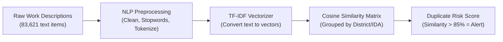

# Pillar 3: Duplicate & Ghost Works Identification Engine

> **Focus:** Detecting Rephrased Proposals, Duplicate Work IDs, & Double-Billed Projects  
> **Core Algorithm:** **NLP (`TF-IDF Vectorization` + `Cosine Similarity`)**  
> **Directory:** `Ml research and docs/PILLAR_3_DUPLICATE_AND_GHOST_WORKS.md`

---

## 1. WHY To Do It (The Problem)
* **Double-Dipping / Duplicate Billing:** A corrupt contractor or agency submits the *same* road repair or solar lighting proposal twice under slightly different wordings to collect double funding.
* **Ghost Projects:** Old completed projects re-recommended under new IDs without creating new public assets.

---

## 2. WHAT To Do (The Objective)
* Use **Natural Language Processing (NLP)** to analyze semantic text similarity across all project descriptions within the same District/Constituency.
* Flag duplicate ID collisions and pairs of projects with **>85% semantic text overlap**.

---

## 3. HOW To Do It (Step-by-Step)



### Step 1: Input Datasets
* [`mplads_recommended_works_2026-08-22.csv`](file:///c:/Users/DIVYA/OneDrive/Desktop/3_Projects_and_Development/Projects/SIH/mplads-risk-analytics/Datasets/mplads_recommended_works_2026-08-22.csv) (`Work Description`, `Work ID`, `IDA`, `Constituency`)
* [`mplads_completed_works_2026-08-22.csv`](file:///c:/Users/DIVYA/OneDrive/Desktop/3_Projects_and_Development/Projects/SIH/mplads-risk-analytics/Datasets/mplads_completed_works_2026-08-22.csv) (`Work Description`, `Work ID`, `IDA`)

### Step 2: NLP Pipeline
1. **Clean Text:** Lowercase, remove special characters, strip common stop words (`"construction of"`, `"renovation of"`, `"ward no"`, etc.).
2. **TF-IDF Vectorization:** Convert cleaned text into numerical n-gram vectors (unigrams + bigrams).
3. **Partition by IDA/District:** Compare projects only within the same district/MP to ensure high speed and eliminate false cross-state matches.
4. **Cosine Similarity Computation:** Measure angle between project description vectors.

### Step 3: Scoring & Alerts
* **Exact ID Match:** Flag duplicate `Work ID`s immediately (**Score: 100**).
* **Text Similarity > 0.85:** Flag as **High Probability Duplicate (Score: 85–100)**.
* **Text Similarity 0.60–0.84:** Flag as **Moderate Overlap / Needs Field Review (Score: 50–84)**.

---

## 4. Real Evidence in Our Dataset
* **30 Duplicate Work IDs** already present in `mplads_recommended_works` (e.g. IDs `1199`, `1738`, `1739`, `1740` logged multiple times with different amounts).
* Thousands of near-identical text entries within identical IDAs (e.g. *"Construction of CC Motorable road near..."*).

---

## 5. Hackathon Talking Point (For Judges)
> *"Numerical models can't read text. We built an NLP semantic similarity engine using TF-IDF and Cosine Similarity bounded by District Authorities. It immediately detected 30 duplicate Work ID collisions in the government data and flags overlapping project descriptions to prevent duplicate funding."*

---

## 6. References & Verification Commands

### 📂 Dataset Source References
* **File:** [`mplads_recommended_works_2026-08-22.csv`](file:///c:/Users/DIVYA/OneDrive/Desktop/3_Projects_and_Development/Projects/SIH/mplads-risk-analytics/Datasets/mplads_recommended_works_2026-08-22.csv)
  * Columns: `Work ID`, `Work Description`, `Category`, `MP Name`, `IDA`
* **File:** [`mplads_completed_works_2026-08-22.csv`](file:///c:/Users/DIVYA/OneDrive/Desktop/3_Projects_and_Development/Projects/SIH/mplads-risk-analytics/Datasets/mplads_completed_works_2026-08-22.csv)
  * Columns: `Work ID`, `Work Description`, `MP Name`, `IDA`

### 💻 Python Command to Cross-Check Numbers
Run this in PowerShell / Python to verify duplicate Work IDs:
```python
import pandas as pd
df_rec = pd.read_csv(r"Datasets/mplads_recommended_works_2026-08-22.csv", encoding="utf-8")
print(f"Total Rows: {len(df_rec):,}")
print(f"Unique Work IDs: {df_rec['Work ID'].nunique():,}")
duplicates = df_rec[df_rec.duplicated(subset=['Work ID'], keep=False)]
print(f"Duplicate Work ID Rows: {len(duplicates)}")
print("\nSample Duplicate Records:")
print(duplicates[['Work ID', 'Work Description', 'MP Name', 'Recommended Amount (₹)']].head(6))
```

### 📖 NLP & Record Linkage References
1. **Salton, G., & Buckley, C. (1988):** *"Term-weighting approaches in automatic text retrieval."* Information Processing & Management, 24(5), 513-523.
2. **Christen, P. (2012):** *"Data Matching: Concepts and Techniques for Record Linkage, Entity Resolution, and Duplicate Detection."* Springer Science & Business Media.
3. **MoSPI MPLADS Operational Manual:** Prohibition of duplicate funding for identical physical locations/assets under multiple parliamentary terms or central schemes.

