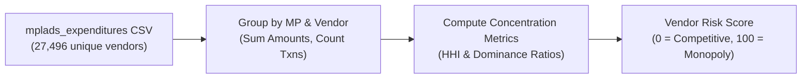

# Pillar 4: Vendor Monopoly & Cartel Risk Engine

> **Focus:** Detecting Contractor Monopolies, Cartel Collusion, & Unfair Allocation  
> **Core Algorithm:** **Herfindahl-Hirschman Index (HHI) + Network Grouping**  
> **Directory:** `Ml research and docs/PILLAR_4_VENDOR_MONOPOLY_AND_CARTELS.md`

---

## 1. WHY To Do It (The Problem)
* **Favored Contractors / Nepotism:** A single vendor captures 70–90% of all MPLADS funding allocated by an MP or District.
* **Shell Contractors:** A newly formed or single-entity vendor bagging hundreds of small transactions across multiple unrelated categories.
* **Lack of Competitive Bidding:** Cartelized vendor networks rotating contract awards among themselves.

---

## 2. WHAT To Do (The Objective)
* Compute market concentration metrics and transaction dominance ratios per vendor across each MP and District Authority (IDA).
* Assign a **Vendor Monopoly Risk Score (0–100)** to every contractor and MP profile.

---

## 3. HOW To Do It (Step-by-Step)



### Step 1: Input Datasets
* [`mplads_expenditures_2026-08-22.csv`](file:///c:/Users/DIVYA/OneDrive/Desktop/3_Projects_and_Development/Projects/SIH/mplads-risk-analytics/Datasets/mplads_expenditures_2026-08-22.csv) (`Vendor`, `MP Name`, `IDA`, `Expenditure Amount (₹)`)
* [`mplads_mp_summary_2026-08-22.csv`](file:///c:/Users/DIVYA/OneDrive/Desktop/3_Projects_and_Development/Projects/SIH/mplads-risk-analytics/Datasets/mplads_mp_summary_2026-08-22.csv) (`Total Expenditure (₹)`)

### Step 2: Key Metrics Calculated
1. **Vendor Share of MP Budget:** `(Total Paid to Vendor / Total MP Expenditure) * 100`.
2. **Herfindahl-Hirschman Index (HHI):** Standard economic index measuring market concentration per District:
   $$\text{HHI} = \sum_{i=1}^n (\text{Market Share}_i)^2$$
   * $\text{HHI} > 2500 \implies$ **Highly Concentrated / Monopoly Market**.
3. **Transaction Dominance:** Single vendor executing hundreds of payments under ₹2 Lakh.

### Step 3: Scoring & Alerts
* **Vendor Dominance > 50% of MP Budget:** Flagged as **Severe Monopoly Risk (Score: 80–100)**.
* **High District HHI (>2500):** Flagged as **Uncompetitive Procurement (Score: 70–100)**.
* **Balanced Distribution (HHI < 1500):** **Low Risk (Score: 0–30)**.

---

## 4. Real Evidence in Our Dataset
* Out of **27,496 total vendors**, the **top 10 contractors bagged over ₹1.71 Billion**.
* **`KRIDL BHUSIRI ACCOUNT WORKS`** captured **₹24.77 Crore** across 353 transactions.
* **`shyam swaroop manufacturere`** captured **1,249 individual transactions** across districts.
* Multiple MPs route >65% of their total released funds to a single contractor name.

---

## 5. Hackathon Talking Point (For Judges)
> *"Fair public procurement requires competitive bidding. Using the Herfindahl-Hirschman Index and vendor graph clustering, our system identifies hidden contractor cartels and vendor monopolies where a single entity captures up to 80% of an MP's developmental budget."*

---

## 6. References & Verification Commands

### 📂 Dataset Source References
* **File:** [`mplads_expenditures_2026-08-22.csv`](file:///c:/Users/DIVYA/OneDrive/Desktop/3_Projects_and_Development/Projects/SIH/mplads-risk-analytics/Datasets/mplads_expenditures_2026-08-22.csv)
  * Columns: `Vendor`, `MP Name`, `IDA`, `Expenditure Amount (₹)`, `Payment Status`
* **File:** [`mplads_mp_summary_2026-08-22.csv`](file:///c:/Users/DIVYA/OneDrive/Desktop/3_Projects_and_Development/Projects/SIH/mplads-risk-analytics/Datasets/mplads_mp_summary_2026-08-22.csv)
  * Columns: `MP Name`, `Total Expenditure (₹)`, `Allocated Amount (₹)`

### 💻 Python Command to Cross-Check Numbers
Run this in PowerShell / Python to verify top vendors and amounts:
```python
import pandas as pd
df_exp = pd.read_csv(r"Datasets/mplads_expenditures_2026-08-22.csv", encoding="utf-8")
print(f"Total Unique Vendors: {df_exp['Vendor'].nunique():,}")
top_vendors = df_exp.groupby('Vendor')['Expenditure Amount (₹)'].agg(['count', 'sum']).sort_values(by='sum', ascending=False).head(10)
top_vendors['sum_in_crores'] = top_vendors['sum'] / 1e7
print("\nTop 10 Vendors by Payout Amount:")
print(top_vendors[['count', 'sum_in_crores']])
```

### 📖 Economic & Procurement Anti-Cartel References
1. **Competition Commission of India (CCI):** Guidelines on detecting Bid Rigging, Collusive Tendering, and Market Allocation in public procurement.
2. **U.S. Department of Justice & Federal Trade Commission (DOJ/FTC):** Horizontal Merger Guidelines — *Herfindahl-Hirschman Index (HHI)* thresholds ($HHI > 2,500$ indicates high market concentration).
3. **World Bank Procurement Integrity Framework:** Red flag indicators for single-source contractor dominance and collusion in public infrastructure.

