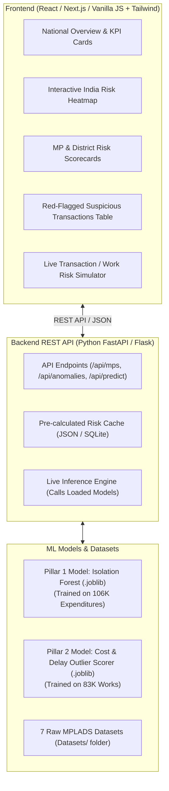
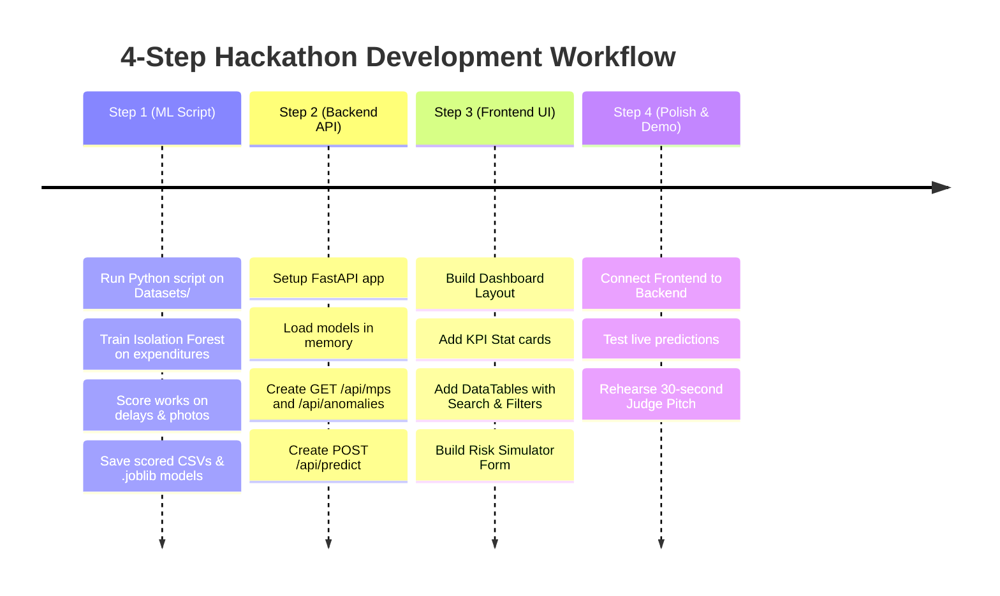

# MPLADS AI Risk Analytics — Full-Stack Development Flow & Backend Integration

> **Scope:** Streamlined Implementation Focusing on **Pillar 1 (Expenditure Anomalies)** & **Pillar 2 (Execution Delays & Cost Overruns)**  
> **Target:** Step-by-Step Guide from ML Models to Backend APIs and Frontend User Interaction  
> **File Location:** `SYSTEM_ARCHITECTURE_AND_DEVELOPMENT_FLOW.md` (Project Root)

---

## Table of Contents
1. [End-to-End System Architecture](#1-end-to-end-system-architecture)
2. [Phase 1: ML Pipeline (Pillar 1 + Pillar 2)](#2-phase-1-ml-pipeline-pillar-1--pillar-2)
3. [Phase 2: Connecting ML to Backend API](#3-phase-2-connecting-ml-to-backend-api)
4. [Phase 3: Frontend Dashboard & User Interaction](#4-phase-3-frontend-dashboard--user-interaction)
5. [Phase 4: User Journey (How Users Access & Use the Model)](#5-phase-4-user-journey-how-users-access--use-the-model)
6. [Step-by-Step Execution Roadmap for Hackathon](#6-step-by-step-execution-roadmap-for-hackathon)

---

## 1. End-to-End System Architecture

The application is structured as a modern **3-Tier Full-Stack Architecture**:



---

## 2. Phase 1: ML Pipeline (Pillar 1 + Pillar 2)

We streamline development by training and exporting **two lightweight models**:

```
                         ┌────────────────────────────────────┐
                         │       ML Training Phase            │
                         └─────────────────┬──────────────────┘
                                           │
                  ┌────────────────────────┴────────────────────────┐
                  ▼                                                 ▼
     ┌────────────────────────┐                        ┌────────────────────────┐
     │   Pillar 1 Model       │                        │   Pillar 2 Model       │
     │  (Isolation Forest)    │                        │ (Outlier & Delay Model)│
     └────────────┬───────────┘                        └────────────┬───────────┘
                  │                                                 │
                  ▼                                                 ▼
      `expenditure_model.joblib`                           `execution_model.joblib`
      + `scored_expenditures.csv`                          + `scored_works.csv`
```

### 1. Pillar 1: Expenditure Anomaly Engine
* **Input:** [`mplads_expenditures_2026-08-22.csv`](file:///c:/Users/DIVYA/OneDrive/Desktop/3_Projects_and_Development/Projects/SIH/mplads-risk-analytics/Datasets/mplads_expenditures_2026-08-22.csv)
* **What it does:** Trains an `IsolationForest` model on transaction amounts, velocity, and ₹1.99 Lakh smurfing flags.
* **Output:** Every transaction gets an **Expenditure Anomaly Score (0 to 100)**.
* **Saved Artifacts:** `expenditure_model.joblib` (for live testing) and a scored CSV/JSON for fast dashboard queries.

### 2. Pillar 2: Execution Delay & Cost Overrun Engine
* **Input:** [`mplads_recommended_works_2026-08-22.csv`](file:///c:/Users/DIVYA/OneDrive/Desktop/3_Projects_and_Development/Projects/SIH/mplads-risk-analytics/Datasets/mplads_recommended_works_2026-08-22.csv) & [`mplads_completed_works_2026-08-22.csv`](file:///c:/Users/DIVYA/OneDrive/Desktop/3_Projects_and_Development/Projects/SIH/mplads-risk-analytics/Datasets/mplads_completed_works_2026-08-22.csv)
* **What it does:** Flags completed works with missing photos (`Has Images == False`), calculates cost inflation ratios, and measures stalled durations.
* **Output:** Every project gets an **Execution Risk Score (0 to 100)**.
* **Saved Artifacts:** `execution_model.joblib` and `scored_works.csv`.

---

## 3. Phase 2: Connecting ML to Backend API

We use **Python FastAPI** (or Flask) as our backend server because it natively executes Python ML models in memory.

### How the Backend Loads Models:
1. When the server boots up, it loads `expenditure_model.joblib` and `execution_model.joblib` into RAM.
2. It serves pre-computed metrics instantly from cached JSON/SQLite for fast UI rendering.
3. For new data inputs, it executes `.predict()` on the live model in <10ms.

### Key REST API Endpoints

| HTTP Method | Route | Purpose | Response Data |
| :--- | :--- | :--- | :--- |
| `GET` | `/api/summary` | National aggregate metrics | Total Allocated, Spent, National Utilization %, Top Anomaly counts |
| `GET` | `/api/mps` | Filterable list of all 764 MPs | MP Name, State, House, Utilization %, Risk Category (Low/Med/High) |
| `GET` | `/api/mps/{mp_name}` | Detailed profile for 1 MP | Historical spending, list of flagged works, suspicious transactions |
| `GET` | `/api/anomalies/transactions` | Top suspicious expenditures | Transactions with Anomaly Score > 75 (smurfing, sudden surges) |
| `GET` | `/api/anomalies/works` | Top flagged works | Projects stalled >2 years or completed with zero photo proof |
| `POST` | `/api/predict/transaction` | Live Risk Simulator | User enters an amount & IDA $\rightarrow$ Model returns Risk Score & Reason |

---

## 4. Phase 3: Frontend Dashboard & User Interaction

The frontend is an **Interactive Decision-Support Portal** designed for both government administrators and public citizens.

### Main UI Views:

```
┌─────────────────────────────────────────────────────────────────────────────┐
│  MPLADS AI Risk Analytics Portal                             [Role: Auditor]│
├─────────────────────────────────────────────────────────────────────────────┤
│  [ Total Allocation: ₹11,621 Cr ] [ Utilization: 33.72% ] [ Red Flags: 842 ]│
├─────────────────────────────────────────────────────────────────────────────┤
│                                                                             │
│   ┌───────────────────────────┐       ┌─────────────────────────────────┐   │
│   │   State Risk Heatmap      │       │     Top High-Risk MPs Table     │   │
│   │   [Interactive India Map] │       │ MP Name | State | Risk | Action │   │
│   │   • Green: Low Risk       │       │ MP "A"  | UP    | 88   | Inspect│   │
│   │   • Red: High Anomaly     │       │ MP "B"  | Bihar | 82   | Inspect│   │
│   └───────────────────────────┘       └─────────────────────────────────┘   │
│                                                                             │
├─────────────────────────────────────────────────────────────────────────────┤
│   🚩 High-Risk Transaction Monitor (Isolation Forest Flagged)               │
│   [Date]       [MP Name]     [Vendor]     [Amount (₹)]   [Anomaly Reason]   │
│   2026-07-02   ATUL GARG     DARSH BUILD   ₹1,99,999     Smurfing Threshold │
│   2026-08-17   ADITYA YADAV  Electromech   ₹1,99,999     Smurfing Threshold │
├─────────────────────────────────────────────────────────────────────────────┤
│   🧪 Interactive Risk Simulator (Test New Project or Transaction)           │
│   [ Enter Amount: ₹_______ ]  [ Select IDA: ______ ]   [ Calculate Risk ]   │
│   ==> Result: Risk Score 85/100 (HIGH RISK - Potential Split Invoice)       │
└─────────────────────────────────────────────────────────────────────────────┘
```

---

## 5. Phase 4: User Journey (How Users Access & Use the Model)

### Persona 1: Ministry Officer / Central Auditor
1. **Logs in** to the portal $\rightarrow$ sees **National Overview** (Utilization %, Unspent ₹7,702 Cr, Red Flag count).
2. **Filters by State** (e.g. Uttar Pradesh, Maharashtra) to identify lagging districts.
3. **Clicks on High-Risk MP** $\rightarrow$ Views automated AI audit card explaining *why* they were flagged (e.g. *"94% fund spent but 42% of works have zero photo proof"*).
4. **Exports Audit Brief** as PDF for official inquiry.

### Persona 2: District Collector / Implementing District Authority (IDA)
1. **Opens District Dashboard** $\rightarrow$ sees pending works awaiting completion sign-off.
2. **Checks Zero-Proof Alerts** $\rightarrow$ Sees 15 projects marked "Complete" without photos and blocks final contractor payment until site photos are uploaded.
3. **Monitors Vendor Outflows** $\rightarrow$ Identifies single contractors receiving back-to-back ₹1.99 Lakh disbursements.

### Persona 3: Citizen / Hackathon Judge (Interactive Simulator)
1. **Visits Public Transparency Portal** $\rightarrow$ searches their local MP to check where funds were spent.
2. **Uses the "Live Risk Tester":**
   * Types in a sample transaction: `Amount = ₹1,99,999`, `MP = XYZ`, `Category = Repair`.
   * Clicks **"Analyze with Isolation Forest"**.
   * The backend model evaluates the transaction in real-time and renders a **Speedometer Gauge (88/100 - High Risk)** with explainable bullet points.

---

## 6. Step-by-Step Execution Roadmap for Hackathon



### Immediate Action Plan:
1. **Step 1:** Create `train_models.py` to generate `expenditure_model.joblib` and scored CSV outputs.
2. **Step 2:** Create `app.py` (FastAPI) to serve the dataset and predictions via clean JSON endpoints.
3. **Step 3:** Build the frontend dashboard to display charts, red flags, and the live risk simulator.
